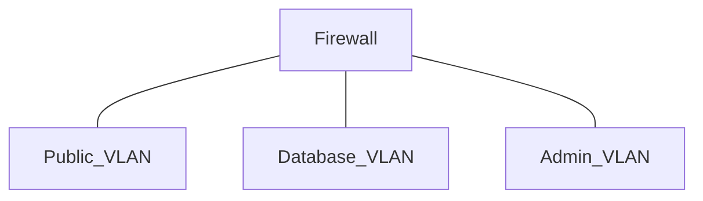
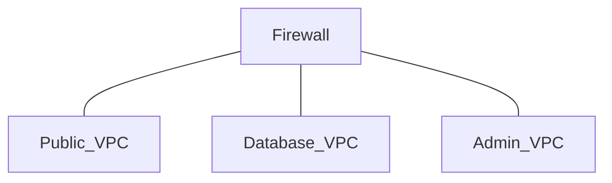

- Cloud customers must build and manage virtual networks in the cloud
- Cloud networking is highly virtualized and customizable

In a traditional data center, virtual LANs (VLANs) separate systems of differing security levels

Cloud providers use virtual private clouds (VPCs) and similar concepts for the same purpose

### VPC Endpoints
Provide secure VPC interconnection

### SDN
Software-defined networking

### SDV
Software-defined visibility