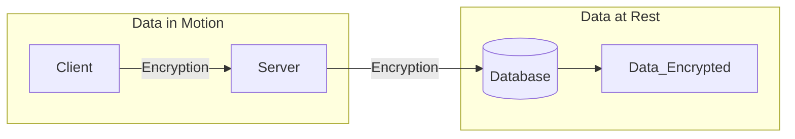

# Machine Learning

>[!info] Machine Learning is a subset of AI

## Machine Learning
Discovers knowledge in data
Data + Statistics

##### Descriptive analylitcs
Describe data
##### Predictive analylitcs
Predict future events and behavior
##### Prescriptive analylitcs
Uses simulation to optimize our behavior

# Blockchain

Distributed, immutable ledger
Prevents tampering and destruction

--> Foundational technology of Bitcoin

##### Applications
- Property ownership
- Traceability for materials in a supply chain
- Vital records

# Internet of Things

Connecting nontraditional devices

#### Security Challenges
- Use difficult-to-update software and underlying OSs
- Connect to home and office wireless networks
- Connect back to cloud services for command and control

#### Industrial Control Systems (ICSs)
Monitor and control industrial processes
- Hacker Targets:
	- Less likely to be current on patches
	- Not well secured
	- Impact

# Containers
see **[[Containers]]**

Lightweight application virtualization

#### Traditional virtualization

Virtual servers run on top of a hypervisor that suppor several guest VMs. VMs can move from hardware to hardware as long as are running ont the same hypervisor
👎Heavy

# Quantum Computing

Leverages quantum mechanics

>[!info] Replace binary bits (0 s and 1s) with multidimensional quantum bits (qubits)

# Edge Computing

Connect IoT with Cloud
#### Premise

- Industrial applications are transforming manifacturing
- Microsatellites are bringing IoT sensors into space
- Agriculture is benefiting from big data analytics
- Distance between sensors and data centers makes computing difficult

#### Edge Computing
Computing **on** the **endpoint**
Brings the advances of the cloud to the *edge* of the networks

#### Fog Computing
Computing **near** the **endpoint**
Involves placing gateways that collect information from edge sensors

# Confidential Computing

Extends security throughout the computing process

>[!important] Normally encryption is not applied to Data in Use

### Trusted Execution Environment
Protects **data in use** from unauthorized access and tampering

# DevSecOps

Development + Operations
- Build collaborative relationships
- Embrace automation
- Facilitate rapid release of code
- Stable environment

--> Linked to AGILE practices
- Both seek continous integration

#### Infrastructure as Code
Scripts the creation of resources

The operations team no longer configures servers and other infrastructure component:
--> They write **scripts** that specify a baseline image that can be customizable to meet specific requirements

##### Advantages
- Increases scalability of environments
- Reduces user error
- Facilitates testing of new code
