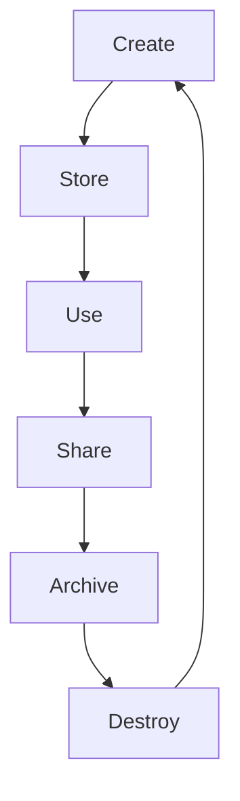

The Cloud Security Alliance data lifecycle explains the stages of data in the cloud

>[!warning] The stages of the lifecycle do not always occur in the same order, and there may not be involved every step

