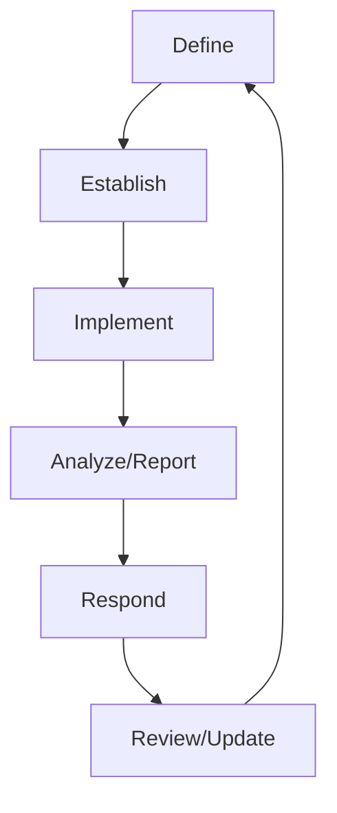

# Security Event Logging

#### Accountability
Who cause the event? Also known as identity attribution
#### Traceability
Uncover all other related events
#### Auditability
Provide clear documentation of the events

--> Artificial Intelligence can help with the data overload

### Security Information and Event Management (SIEM)
Correlates security event information
##### Central, secure collection point for logs
##### Source of artificial intelligence

- Access to log entries from across the organization
- **Intrusion Detection System**
- **Firewall Log**
- **Web Server Log**
- **Database Log**
- **Router Log**

---
# Tuning and configuring SIEMs

The respository associated with the SIEM should act as a **WORM** repository

#### Write Once, Read Many (WORM)
Prevent unauthorized changes

#### Synchronizing System Clocks
Enables consistent analysis
--> Centralized server running **Network Time Protocol (NTP)** (standardized way to synchronize)

### SIEM  Tuning
Customize configurations
- Modify rules to prevent false positive alerts
- Block trivial and irrelevant SIEM alerts

---
# Continous Security Monitoring

Maintaing ongoing awareness of information security, vulnerabilities, and threat to support organizational risk management decisions

Monitoring Process:

*NIST SP 800-137*

#### Anomaly/Heuristic Analysis
Detects outlier data points
#### Trend Analysis
#### Behavioral Analysis
#### Availability Analysis
Provides uptime information

---
# Chain of Custody

^51a39f

Provides a paper trail of evidence

Evidence should be labele and stored in a sealed evidency container --> **Beginning of chain of custody**

### Evidence Log Events
Must be available to present in court

1. Initial collection
2. Transfer
3. Storage
4. Opening and resealing the container

### Evidence Log Entry Details

- Investigator name
- Data and time
- Purpose
- Nature of action