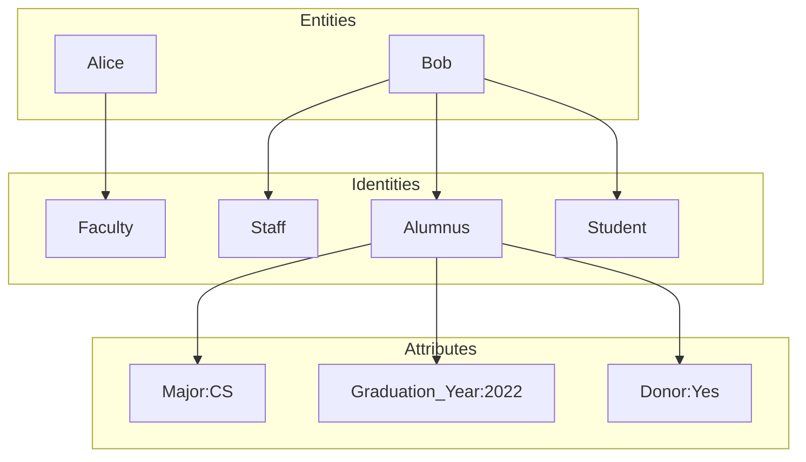
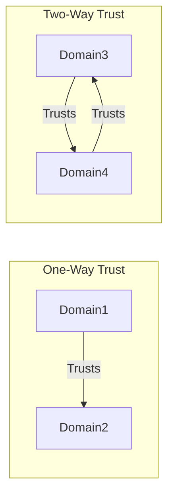
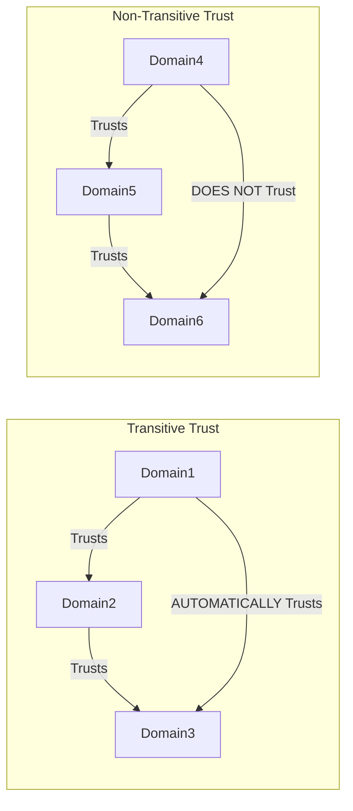
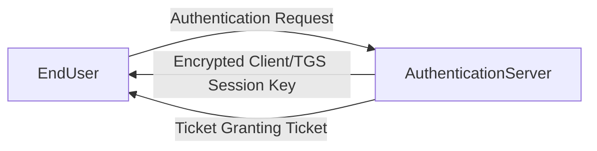
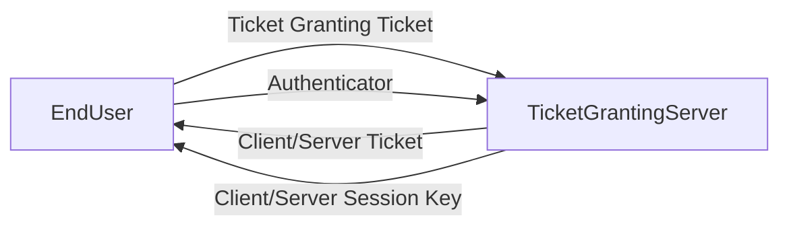
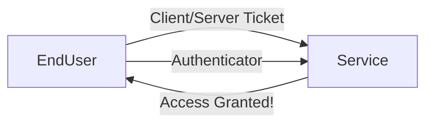

# Introduction

Entities vs Identities

# Identification, authentication and authorization

### Identification
User makes only a **claim**
### Authentication
User **proofs** their identity
### Authorization
Checks if identified user is **allowed** to acces
### + Accounting
Logs

# Provisioning and Deprovisioning

### Provisioning
 After onboarding, administrators create authentication create authentication credentials and grant appropiate authorization
### Deprovisioning
Durinf the offboarding process, administrators disable accounts and revoke authorizations at the appropiate time
**Prompt terminations is essential**

- Routine workflow. Disables accounts on a schedules basis for planned departures
- Emergency workflow. Immediately suspends access when user is unexpectedly terminated

# [[Authentication]] Factors

- **False Accptance Rate (FAR)**
- **False Rejection Rate (FRR)**
They are not good measures on tehir own

--> *Crossover Error Rate (CER)*

# [[Multifactor Authentication]]

# SSO and federation

### Federated Identity Management
Individual may have accounts across multiple systems
#### Google Federation
#### Facebook Federation
#### Twitter Federation

### Single Sign-On
Authentication system that shares a single authentication session across multiple systems, avoiding asking users to log in multiple times

- SSO presents users with a single login screen and creates a session that persists across other systems

*Shibboleth Consortium*: federated situations

### Trust Characteristics

- **Direction** (one way or two way)

- **Transitivity** (transitive or nontransitive)
Transitive: trust relationships transfer across domains

# Kerberos and LDAP

### Kerberos

Kerberos is one of the core protocols for Microsoft Active Directory

>[!info] Kerberos
>Ticket-base authentication system that allows users to authenticate to a  centralized service and then use tickets to gain access to distribute services

End User obtains **Client/TGS Session Key** from Authentication Server (AS)

Ticket Granting Server (TGS) obtains Client/TGS Session Key 
Ticket Granting Server (TGS) creates a Client/Server Session Key
End User obtains **Client/Server Session Key**

Ticket Granting Server (TGS) obtains Client/Server Session Key 

--> Kerberos handles **authentication**

| Protocol | Port |
| -------- | ---- |
| TCP      | 88   |

### LDAP
**Lightweight Directory Access Protocol**

>[!info] LDAP
>Provides the means to query a centralized directory service, such as Microsoft Active Directory

LDAP provides the **means to query information stored in the directory service**

| Protocol | Port | Description |
| -------- | ---- | ----------- |
| TCP      | 389  | Unencrypted |
| TCP      | 636  | Encrypted   |

### NTLM Authentication

**NT LAN Manager**
- Was widely used on Windows systems for many years
- Depends on hash-based challenge
- 👎Weak encryption
- 👎Pass the hash

>[!warning] Avoid the use of NTLM

# SAML

Security Assertion Markup Lasnguage (SAML) allows SSO within a web browser across a variety of systems

##### Benefits
- True SSO experience for end users
- No credential access for service providers

# OAuth and OpenID Connect Users

### OAuth 
**Authorization** protocol

### OpenID
**Authentication** protocol

# Security Service Providers

- Managed service providers (MSPs) offer information technology aservices to customers
- Manages Security Service Providers (MSSPs) / *SECaaS* provide security services for other organizations as a managed service --> **Carefully monitored**
- Cloud access security brokers (CASBs) ass a third-party security layer to the interactions that users have with other cloud services
		*Network-Based CASB*: Broker intercepts traffic between the user and the cloud service, monitoring for security issues. It can block requests
		*API-Based CASB*: Broker queries the cloud service via API. It may not be able to block requests, depending upon API capabilities

# Identity as a Service (IDaaS)
Allow organizations to move IAM to the cloud

- IDaaS provides SSO for web-based services
- IDaaS allows MFA
##### Directory Integration
Synchronize with organization's on-premises or cloud-based directory to obtain user information
##### Application Integration
Replace the authentication services for many SaaS products, simplifying the user and administrative experience

# Privileged Access Management (PAM)

### Password Vaulting
Stores administrative passwords
### Command Proxying
Eliminates the need for direct server access
### Monitoring
Logs administrative user activity
### Credential Management
Rotates passwords and acess keys

--> PAM should provide an emergency access workflow