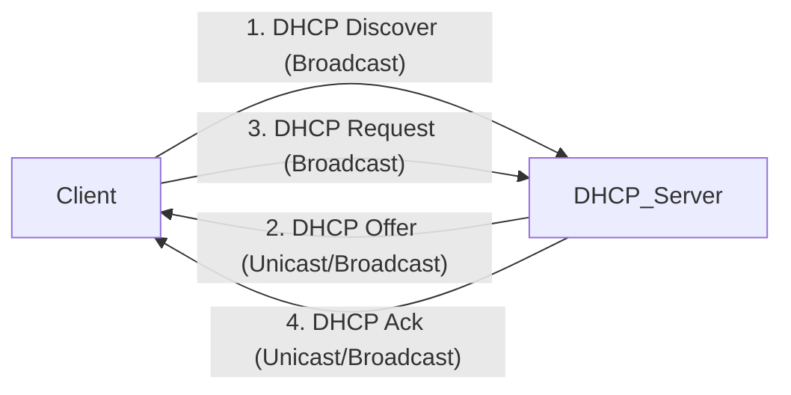

## DNS

Where the DNS server is hosted  (*nameserver*) --> `cat /etc/resolv.conf`

### DNS Filtering
Uses the DNS to block access to specific websites or services based on predefind criteria
--> Prevents threats (block malicious sites, reduce attack surface)
--> Control content
--> Enhance privacy and reduce malware

1. A user enters a URL
2. The DNS system
	1. Intercepts the query
	2. Performs a policy check
	3. Allows or disallows the URL
#### Types of DNS filtering

- **Security-based**
- **Content-based**
- **Custom**

--> can be either on the network (cloud-based) or on individual devices
## DHCP

DHCP handshake contain four packets:
- **Discover**
The system (that want to connect to a network) will try to discover the DHCP server
- **Offer**
The DHCP Server sends IP Address details (has the MAC address, the IP address, the subnet mask and the IP address of the DHCP server)
- **Request**
Accept offer
- **Acknowledgement**
Confirm IP Lease

