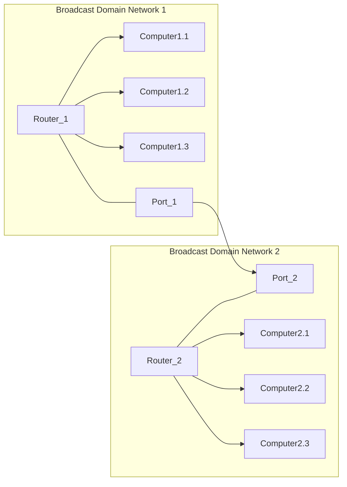

Every connected device mantains its routing table

Specific **network interfaces** (*enp0s9*, *enp0s8*, *enp0s3*) handle traffic within their respective **broadcast domains**. while swithces use MAC tables for efficient packet delivery based on MAC addresses

>[!info] Same network interface, same broadcast domain
> Broadcast domain = Virtual LANs (VLANs)

## Components of network communication

#### Broadcast domain
Enables direct communication among devices at the data link layer

#### Default gateway
Connects local networks to external networks via routing
-->*The default route is the gateway*
#### Routing table
Lists routes to network destinations for efficient packet forwarding

#### ARP table
Matches IP addresses with MAC addresses on the same network

