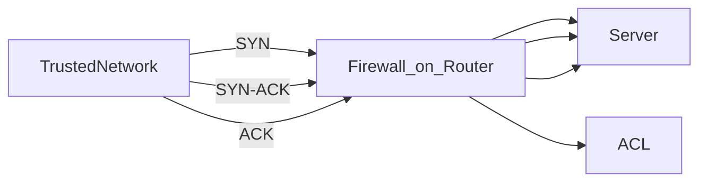

>[!info] Definition
>- Inspects data packets individually
>- Does not use knowledge of previous packets
>- Does not maintain a database or session table of inspected packets

>[!info]
>1. Examines the IP address at the source port
>2. Might use an ACL or access control list rule

>[!info]
>3. Examines the IP address at the destination port
>4. Repeats the process packet-by-packet

## Use cases
- Control traffic going in or out of your organization
- Troubleshoot network purposes

> [!info] Benefits
> - Fast
> - Provides control
> - Supports troubleshooting

