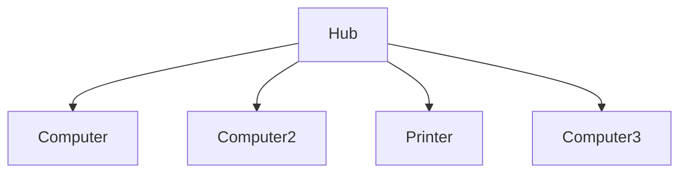
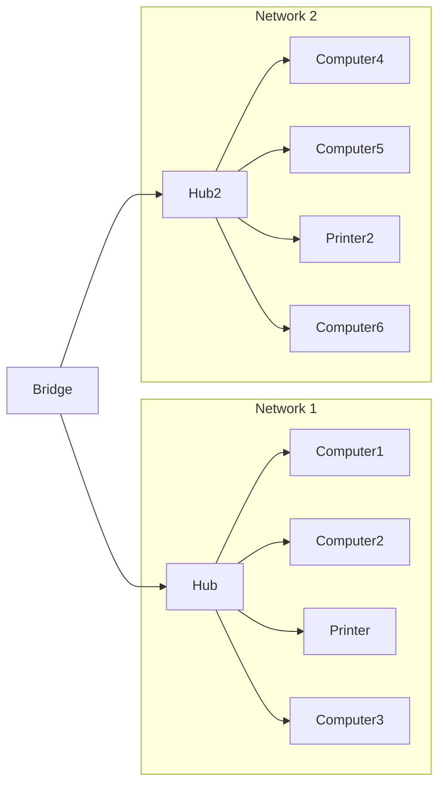

## Network devices

### Server
Powerful computer that stores files and applications.
- Other computers or devices on the same network can access the server
- The devices that access the server are known as clients
- A user can access a server file or application from anywhere

### Node
A node is a network-connected device that can send or receive information
- All devices that can send, receive, and create information on a network are nodes
- The nodes that access servers to get on the netwrok are known as clients

## Client-Server vs Peer-to-Peer Networks
### Client-Server networks
Are common in businesses, with the server controlling client access
e.g.
- FTP files
- Web servers
- Web browsers

### Peer-to-Peer networks
Common in homes and on the internet, allow users to share resources and inforamtion directly
e.g.
- File sharing sites
- Discussing forums
- Media streaming
- VoIP services

## Network Hardware
### Hubs and switches

#### Hub
- Connects multiple devices together
- Broadcasts to **all devices** except sender

#### Switch
- Keeps a table of MAC addresses
- Sends directly to the intended recipient (more efficiently than hubs) based on MAC addresses

### Routers and modems

#### Routers
- Interconnect different networks or subnetworks
- Manage traffic between networks by forwarding data packets
- Allow multiple devices to use the same internet connection
- Routers use internal routing to direct packets effectively (have internal routing table)
The router:
- Reads a packet's header to determine its path
- Consults the routing table
- Forward the packet

#### Modem
- Converts data into a format that is easy to transmit across a network
- Data reaches its destination, and the modem converts the data to its original form
- Hardware device that enables communication between computer (or other digital device) and a telephone or cable network
- Most common modems are cable and DSL (aldo Fiber optics and Dial-up)

### Bridges and gateways

#### Bridges
- Joins two separate computer networks so they can communicate with each other and work as a single network
- Can be wired or wireless:
	- Wi-Fi to Wi-Fi
	- Wi-Fi to Ethernet
	- Bluetooth to Wi-Fi

#### Gateway
- Allow data flow using protocol to connect multiple networks
- e.g. (home Network to the Internet)

### Repeaters and WAPs

#### Repeaters
- Receive a signal and retransmit the signal
- Extend a wireless signal
- Connect to wireless routers

#### Wireless access points
- Allows Wi-Fi devices to connect to a wired network
- Usually connect to a wired router as a standalone device
- Act as a centrar wireless connection point for computers equipped with wireless network adapters

### Network Interface Cards (NICs)

^9bda1d

NICs connect individual devices to a network
Is responsible for implementing the necessary network protocols
It handles the encoding, decoding, and framing of network data according to the supported protocols
It is also responsible for transmitting data from the device to the network and receiving data from the network
- Each NIC has a unique MAC address (hardware address that identifies the device on the local network)
- Wired or wireless

### Firewall, proxies, IDS, and IPS
#### Firewall
A firewall monitors and controls incoming and outgoing network traffic based on predetermined security rules.
- Can be software of hardware
- Routers and operating systems have built-in firewalls

#### Proxy server
Acts as intermediary between LAN and Internet
- Works to minimize security risks
- Evaluates request from clientes and forwards requests to the appropiate server
- Hides an IP address
- Saves bandwidth

#### IDS
Monitors network traffic and reports malicious activity to network admin

#### IPD
Inspects network traffic and removes, detains, or redirects malicious items based on rules set by the admin

