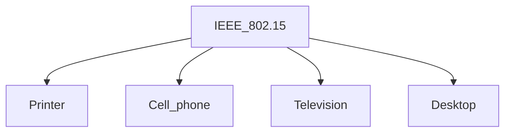
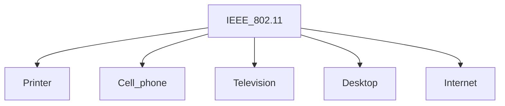
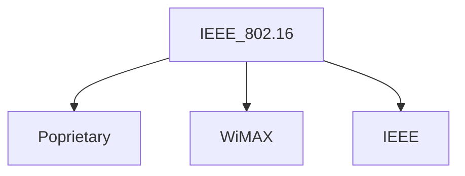
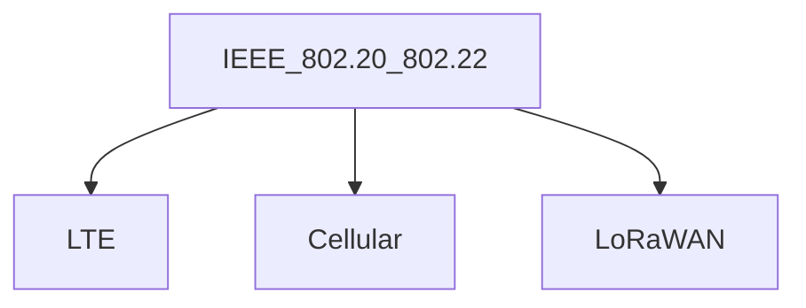

## Network types

### Wireless Personal Area Network (WPAN)
A WPAN connects devices within the range of an individual person (10 m). WPANs use signals like infrared, Zigbee, Bluetooth, and ultra-wideband.

##### Pros and Cons

👍Flexible and effcient
👍One-time Easy setup
👍Portable

👎Limited range
👎Limited data rates
👎Expensive
#### IEEE 802.15

### Wireless Local Area Network (WLAN)
A WLAN connects computers and devices within homes, offices, or small businesses. WLANs use Wi-Fi signals from routers, modems, and wireless access points to wirelessly connect devices.

##### Pros and Cons

👍Reliable and versatile
👍High data transmission rates
👍Easy to manage

👎Low network coverage area
👎Number od devices affects speed
👎Less secure
#### IEEE 802.11

### Wireless Metropolitan Area Network (WMAN)
A WMAN spans a geographic are (size of a city). It serves ranges greater than 100 m.

##### Pros and Cons

👍Covers multiple areas
👍Easy to use, extend, and exchange
👍Managed by an ISP, governemtn entity, or corporation

👎Requires special user permissions
👎Slower than wired
👎Less secure
#### IEEE 802.16

### Wireless Wide Area Network (WWAN)
A WWAN provides regional, nationwide, and global wireless coverage. THis includes private netwroks of multinational corporations, internet, and cellular networks like 4G, 5G, LTE, and LoRaWAN.

##### Pros and Cons

👍Global wireless coverage
👍Better security than WLAN
👍Centralized, flexible infrastructure

👎Expensive
👎Difficult to mantain
👎Decreased coverage over large areas
#### IEEE 802.20 802.22

### Wireless Ad hoc Network (WANET)
A WANET uses Wi-Fi signals from whatever infrastructure happens to be available to connect devices instantly, anywhere. WANETs are similar in size to WLANs but use technology that is closser to WWANs and cellular networks

##### Pros and Cons

👍Flexible
👍No required infrastructure
👍Can be set up anywhere instantly

👎Limited bandwidth quality
👎Not robust
👎Security risks
#### IEEE 802.20 802.22

### Cellular Networks Evolution

#### IEEE 802.20 802.22

| 2G            | 3G               | 4G              | 5G       |
| ------------- | ---------------- | --------------- | -------- |
| Digital voice | Mobile broadband | Advanced speeds | Next gen |
| 64 Kbps       | 2 Mbps           | 100 Mbps        | 1 Gbps   |

##### Pros and Cons

👍Flexible
👍Access
👍Speed and effciency

👎Expensive
👎Decreased coverage
👎Hardware limitations