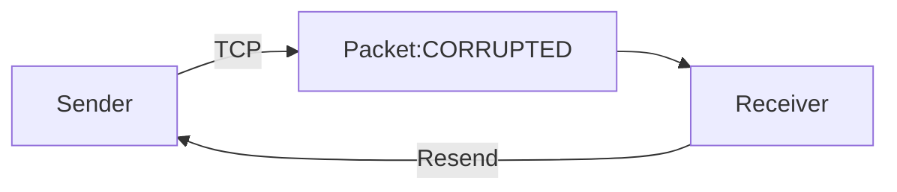

### TCP

- Contains the sender, and identifying recipient, and data verification packets
- Provide an ordered list of packets sent and received
- Require time-consuming overhead
- Required by some applications

--> Acknowledgement is not required to transmit every package
--> Data sent in series waits for response
--> Sequence numbers help to identify missing packets

![[TCP_header.png]]

#### Real-world applications of TCP

##### HTTP
Cycle:
- Client request
- Server response

##### HTTPS
Addresses privacy and security needs of HTTP
Uses SSL certificates to encrypt and transmit data
##### SMTP

##### FTP

### UDP

- Send data without a delivery confirmation
- Sends data in bulk with an address
- Does not provide delivery confirmation
- Reassembles data in arrival order
- Requires litte overhead, very fast

#### Real-world applications of UDP

Specifying source and destination ports to ensure proper communications

##### Trivial File Transfer Protocol (TFTP)
Uses UDP on port 69
Similar to FTP but uses UDP
Suitable for small file transfers

##### Domain Name Systems (DNS)
Uses port 53
Uses UDP for name queries
Uses TCP for reliable tasks

##### Simple Network Management Protocol (SNMP)
Uses ports 161 and 162
Can also use TCP
Translates domain names to IP addresses

##### Dynamic Host Configuration Protocol (DHCP)
Uses port 67
Automatically assigns IP addresses
Manages a pool of IPs

##### Voice over IP (VoIP)
Uses port 5060
Can use TCP or UDP
Sends voice over the Internet

##### Internet Protocol Television (IPTV)
Streams TV signals
Uses UDP and TCP
USes ports 80, 5004, and 12000

