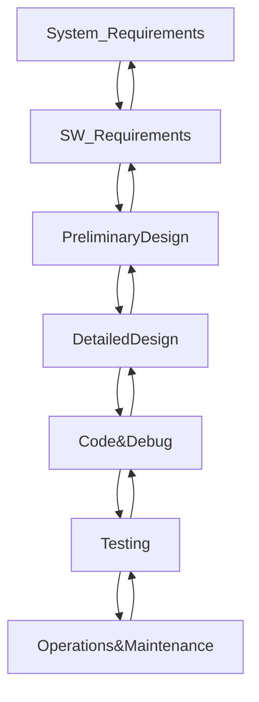
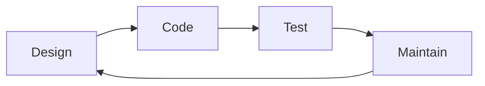
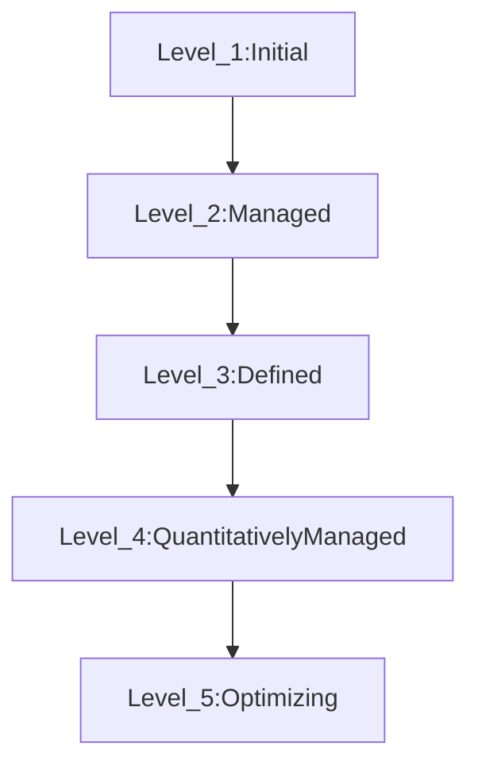
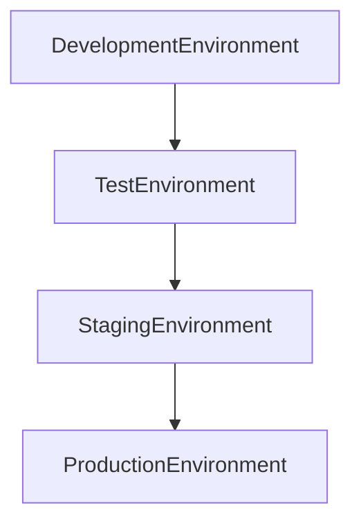

# Development methodologies
### Waterfall Model

- Linear process

- Very rigid

### Spiral Model

- Iterative motion

### Agile Model

[Manifesto for Agile Software Development](https://agilemanifesto.org/)

![[AgileManifesto.png]]

---
# Secure Software Development Cycle (SDLC)

- Organizations choose a development methodology to implement their own SDLC

---
# Maturity Models

Provide standard benchmarks

### Capability Maturity Model Integration (CMMI)
Assesses an organization's process maturity

### IDEAL Model

- **I**nitiating
- **D**iagnosing
- **E**stablishing
- **A**ction
- **L**earning

---

# Operation, Maintenance, and Change Management

Standarized code release process
Software development is never finished

### Change Management

- **Request** control: manages, evaluates, and priorities inboud requests from customers
- **Change** control: grants permission for developers to make changes to application code
- **Release** control: moves the code from the development environment into production

### Code Environments

---
# DevOps

Merging two worlds: [[Software Design Lifecycle#^0140b8|DevOps]]
Facilitates security automatization: **DevSecOps**

> [!info] DevOps and Agile are related; both seek continuous integration

> [!important] Cloud technologies is one of the enabling technologies for DevOps environments.

DevOps embraces **Infrastructure as Code**: scripts the creation of resources
- Standard baseline for configuration
- Separates server configuration from virtual or physical servers

##### Advantages of Infrastructure as Code

- 📈scalability of environments
- 🔻user error
- Facilitates testing of new code
##### DevOps Tools
- Continuous validation
- Continuous integration
- Continuous delivery
- Continuous deployment
- Continuous monitoring

---
# SOA and microservices

### *Service-Oriented Architecture (SOA)*
Design philosophy that embraces the use of discrete services that may be accessed by customers in a black-box fashion

- Facilitate the integration of other services
##### Service Characteristics
- Logical representations of a repeatable business activity with a specified outcome
- Self-contained
- May be composed of other services
- Black-box nature

### Microservices
Fine-grained services

