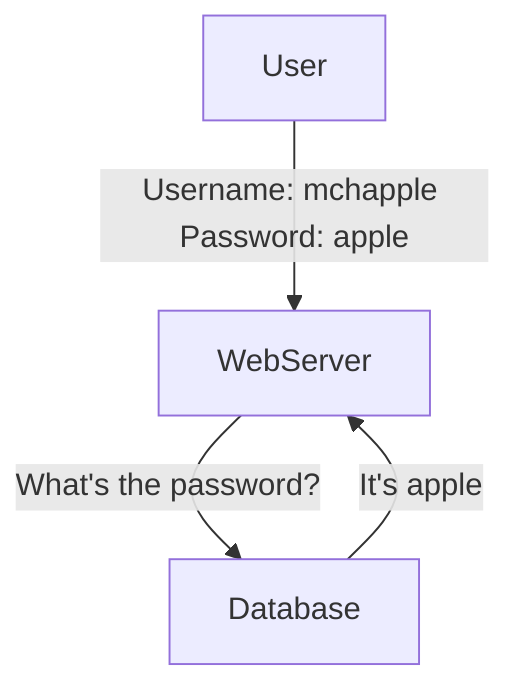

#### Open Web Application Security Project (OWASP)
Maintains a list of common web security issues
#### SANS Institute
#### Center for Internet Security
# Common cloud vulnerabilities

### Broken Access Control
Allow unauthorized access
- Includes *Insecure Direct Object References (IDOR)*
### Cryptographic Failure
Allows access to sensitive data
### Injection Flaw
Inserts unwanted code
### Insecure Design
Fails to meet security requirements
### Security Misconfiguration
Occurs in many possible locations
### Vulnerabale Components
Can jeopardize application security
### Authentication Failure
Exploits session management
- Session Hijacking
### Integrity Failure
Allows insertion of insecure code
### Monitoring and Log Failure
Can deprive analysts of needed data
### Request Forgery
Tricks servers into requesting URLs

---
# Application Security

### Application Hardening

- Use proper authentication
- Encrypt sensitive data
- Validate user input
- Avoid and remedaite known exploits
- Deploy obfuscation and camouflage
### Prompt Patching is Critical
Attackers quickly exploit new vulnerabilities

> [!important] Configuration baselines allow quick identification and remediation of security gaps

---
# Preventing [[Inyección SQL|SQL injection]]

### Database-Driven Authentication



- Applications request data from databases using *Structured Query Language (SQL)*

```
SELECT username, password
FROM user_accounts
WHERE username = 'mchapple'
```
##### Modification
```
SELECT username, password
FROM user_accounts 
WHERE username = 'mchapple';
UPDATE user_accounts
SET password='hacked'
WHERE username='mchapple';
--'
```

>[!info] Semicolons separate SQL statements

>[!info] Two dashes indicate comments

> [!warning] Single quotes are critical to SQL injections

##### Solutions

- **Input Validation**: Protects against unsafe user input by checking it on the server before executing commands
- **Parameterized SQL**: Precompiles SQL code on the databse server to prevent user input from altering query structure

---
# Cross-Site Scripting ([[Cross-site scripting (XSS)|XSS]])

An attacker embeds malicious scripts in a third-party website that are later run by innocent visitors to that site

- HTML enhances websites with formatting and images --> **HTML tags**
	*<script\>* tag
*<iframe src\="javascript:alert('xss')>"*
##### Solution

- **Input Validation**: do not allow *<script\>* tags in user-supplied input

---
# Request Forgery

#### [[Cross-site Request Forgery (CSRF)|CSRF]] , XSRF, and *sea-surf*
--> Client-side attack
Leverages the fact that users are often logged into multiple sites at the same time and use one site to trick the browser into sending malicious requests to another site without the user's knowledge.

It usually uses ** tags for embeding malicious scripts. Once the page loads the image, the script is executed

##### Solutions
- Rearchitect web applications
- Prevent the use of HTTP GET requests
- Advise users to log out of sites
- Automatically log out users after an idle period

#### Server-Side Request Forgery ([[Server Side Request Forgery (SSRF)|SSRF]])
--> Targets servers rather than users, by manipulating servers into retrieving malicious data from what it believes to be a trusted source

---
# Directory [[Path traversal|traversal]]

Uses directory navigation references to search for unsecured files on a server
--> Tool: *WebGoat*

##### Solutions
- **Input Validation**
- **System Access Control**

---
# Overflow attacks

Developers ser aside areas of memory called buffers to store user-supplied content
Attacker use larger input than it's available

--> Results in an **unexpected outcome**

##### Solution
- **Input Validation**

---
# Cookies and attachments

Cookies are data stored by websites in user browsers
- Useful to recognize users
- **Used in apps, too**
##### Privacy risks
- Cookies can be used across different websites
- Cookeis can track user activity

---
# Session hijacking

Cookies provide an easy shortcut for web authentication

- **Guessable Cookies**: jeopardize security
- **Session Replay**: possible if cookie values are not encrypted in transit

##### Solution
- Secure attribute: encrypt cookie

---
# Code execution attacks

An attacker exploits a vulnerability in a system that allows the attacker to run commands on that system

- **Arbitrary code execution**: attacker runs commands of their own
- **Remote code execution**: take place over a network connection

##### Solutions
- Limite administrative access
- Patch systems and applications

---
# Privilege Execution

Gains administrative access

--> Often exploit **buffer overflow vulnerabilities**

##### Solutions
- **Input Validation**
- **Patch** systems, platforms and applications
- **Enforce the least privilege principle**
- **Use DEP (*Data Execution Prevention*) and ASLR (*Address Space Layout Randomizations*) technologies **