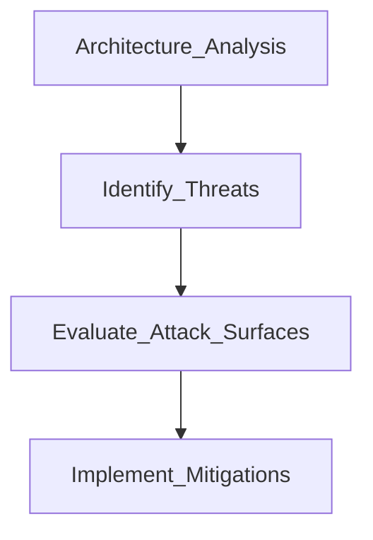

# Identifying Threats
### Asset Focus
Use the asset inventory as the basis for the analysis
### Threat Focus
Identify how specific threats may affect each information system
### Service Focus
Identify the impact of various threats on a specific service

# Risk analysis and mitigation

- **Risk analysis** identifies issues
- **Risk mitigation** reduces their likelihood and impact

Cibersecurity professional 🤝Software developer

#### Integrate Security with the SDLC
Avoid bolt-on security!
#### Mitigate Sofware Risks
- Performing input valdiation
- Encrypt sensitive data
- Enforce the least privilege principle
- Test all code prior to deployment
#### Sandboxing
Isolate development code
Testing and development environments where programmers can work with code to modify and test withour having access to any production resources

# Threat Modeling

Evaluates the types of attacks possible against systems

#### STRIDE model

- **S**poofing: impersonation
- **T**ampering: unauthorized modifications
- **R**epudiation: deny responsibility for actions
- **I**nformation Disclosure: steal confidential information
- **D**enial of Service: prive from authorized users access to resources
- **E**levation of Privilege: take normal user accounts and transform it into a super user account

#### PASTA model
*Process of Attack Simulation and Threat Analysis*

#### DREAD model

- **D**amage
- **R**eproduce
- **E**xploit
- **A**ffected individuals
- **D**iscoverability

#### ATASM model

#### Reduction Analysis
Breaks a system down into smaller components

##### Total Attack Surface
All of the systems and services that could present potential points of entry for an attacker
##### Attack Vector
The means used by an attacker to gain initial access to a system of network

