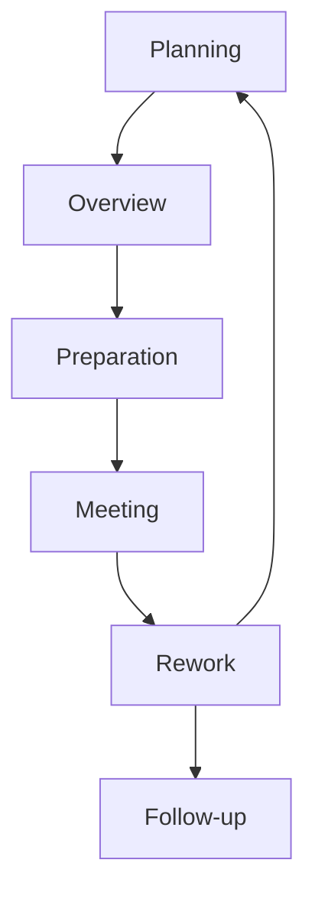

# Code Review

Use peer analysis toa ssess code

#### Fagan Inspection
Formal approach

# Software Testing

Ensures that finished code functions properly

### Verification and Validation

1. **Software model validation**
	- Are we building the *right software?*
2. **Software verification**
	- Are we building the *software right?*
### Stress / Load Testing

- Uses automated scripts to verify system capacity
- May be run internally or through a vendor
- Verifies the system can handle the maximum expected load
- Determines the maximum capacity of the system
### User Acceptance Testing (UAT)
Ensures software will work for users

*a.k.a. Beta-testing*
### Regression Testing
Checks for unexpected side effects

# Code Security Tests
Checks software for application security flaws

### Static Application Security Testing (SAST)
Uses automated techniques to analyse code for errors and security flaws without actually executing the code
#### Software Composition Analysis (SCA)
Identifies the use of open-source software libraries

### Dynamic Application Security Testing (DAST)
Executes code to verify that it is functioning correctly and doesn't have security flaws
#### Synthetic transactions
Scripted sets of input provided to code

### Interactive Application Security Testing (IAST)
Uses dynamic testing techniques but allows the tester to interact with the software abd guide the process as the test is underway

### White-Box Test
^951ea9
Testers have access to the source code
### Black-Box Test
^f9d0a9
Testers do not have access to the source code

# Abuse case testing

>[!warning] Software often expect users to behave normally

**Misuse case testing** evaluates software from teh attacker's perspective --> brainstorming sessions

# Fuzzing

Software testing technique that feeds software many different input values in an attempt to cause an unpredictable state or unauthorized access

#### Fuzz Testing Input Sources
- Developer-supplied input
- Developer-supplied script
- Generation fuzzing
- Mutation fuzzing

> [!warning] Fuzzing is an offensive tool --> Only fuzz test with permission!!

# Code repositories

Provide secure storage and version control
- Help to avoid dead code

#### Tool: git

`git diff <file>` : displays differences between local file and cloud repository
`git checkout -- <file>`: pulling the latest <file\> of git repository (undoing local changes)

>[!warning] Remove sensitive information from code before publishing it

### Integrity measurement
Verifies release code is unchanged: hash functions

# Application Management
Restricts software that may run

e.g **AppLocker** in Windows
#### [[3. Secure Coding Practices#^919df3|Whitelisting]]
#### [[3. Secure Coding Practices#^61278e|Blacklisting]]

### Host Software Baselining
Identifies expected system software