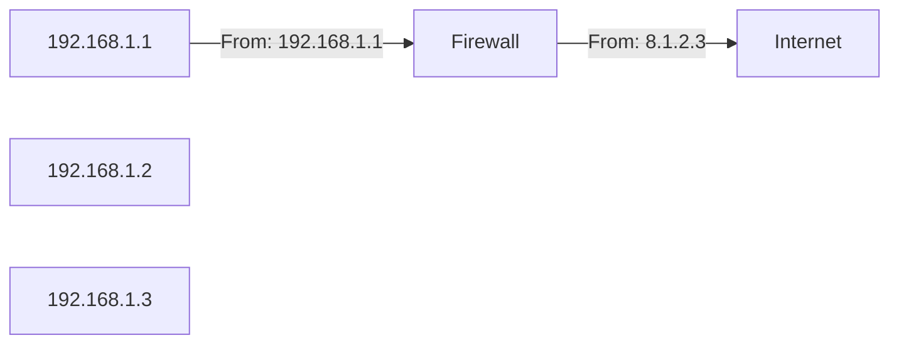

# [[TCP-IP]]

# Public and Private Addressing

#### Public IP Addresses
Assigned by a central authority and are **routable over the Internet**
Managed by **ICANN**:
- **I**nternet
- **C**orporation for
- **A**ssigned
- **N**ames and
- **N**umbers

ICANN distributes large blocks of addresses to regional authorities for distribution
--> **IP Addresses Scarce**: No large blocks available *IPv4 allows for 4.3 billion possible addresses*
--> Purchase or rent from other organizations, **ISP**

The solution to this dilemma is the use of private IP Addresses
#### Private IP Addresses
Available for anyone's use but **not routable over the Internet**

- 10.0.0.1-10.255.255.255
- 172.16.0.1-172.31.255.255
- 192.168.0.1-192.168.255.255

### Organizations Mix
Public and private addresses

| Private     | Public  |
| ----------- | ------- |
| 192.168.1.1 | 8.1.2.3 |

[[Network Address Translation (NAT)]] requires a large pool of public IP addresses

##### Port Address Translation (PAT)
Allows multiple systems ro share the same public address
Assigns unique ports to each communication

# Subnetting

Subnet masks identify the dividing line between network and host addresses
--> 1s for the network, 0s for the host part

##### Subnet Mask Notation
- IP Address: 192.168.1.100
- Subnet mask: 255.255.255.0
##### Slash Notation
- 192.168.1.0/24

# VLANs and network segmentation

VLAN extend broadcast domain
Switches carry VLANs on layer 2