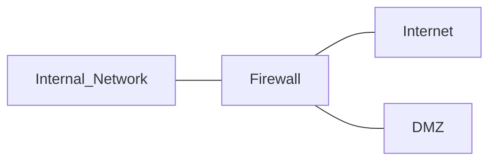

# [[Cyberminds Academy/Week 2/Security Architecture/Network Security Devices/Firewalls|Firewalls]]

##### Demilitarized Zone (DMZ)
Contains systems that must accept direct external connections
Isolates those systems due to risk of compromise
Protects internal network form compromised DMZ
System inside DMZ: **Bastion Host** must be carefully hardened

- [[Stateless Inspection]]
- [[Stateful Inspection]]
# Network Security Groups

Cloud service providers do maintain firewalls, but customers can't modify them directly
- Serve as IaaS firewalls 
- Maintaining network security groups is a customer responsibility

# [[VPNs and VPN concentrators]]

# [[Network intrusion and prevention]]

# [[Zero Trust networking]]
