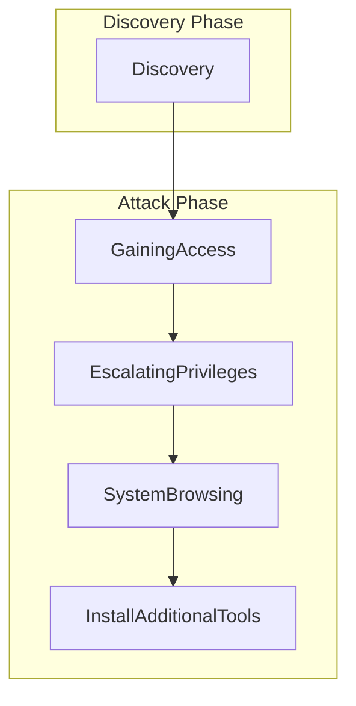

# [[Vulnerability Management]]

--> FISMA Requirements

**Vulnerability Report Outcomes**

|                | Vulnerability Reported | Vulnerability Not Reported |
| -------------- | ---------------------- | -------------------------- |
| Exists         | True Positive          | False Negative             |
| Does not exist | False Positive         | True Negative              |

# Correlating scan results

Consult industry standards, best practices and compliance requirements

# [[Penetration Testing]]

#### Pivot
After exploiting a vulnerability in a system, attacker use that system as a base from which to target other systems on the same local network

#### Persistence
After exploiting a vulnerability in a system, attackers install tools on that system to allow future access--even if the initial vulnerability is corrected

--> *Clean up at the end of the attack*

# [[Deception Technologies]]

# Bug Bounty
Open security programs

Bug Bounty programs allow you to harness the work of hackers for your own purposes
*e.g. hackerone*

- Vendors offer both **self-managed** and **fully-managed** bounty programs