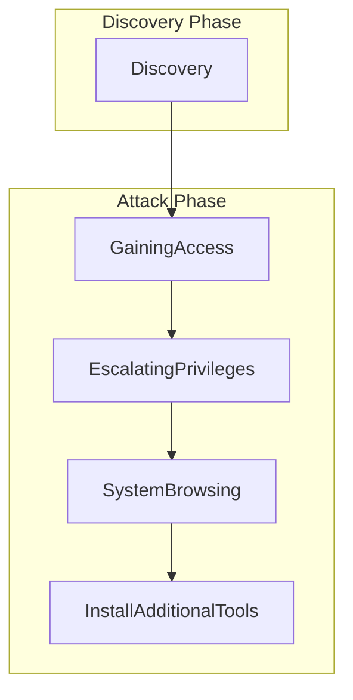

# [[Vulnerability Management]]

--> FISMA Requirements

**Vulnerability Report Outcomes**

|                | Vulnerability Reported | Vulnerability Not Reported |
| -------------- | ---------------------- | -------------------------- |
| Exists         | True Positive          | False Negative             |
| Does not exist | False Positive         | True Negative              |

# Correlating scan results

Consult industry standards, best practices and compliance requirements

# [[Penetration Testing]]

#### Pivot
After exploiting a vulnerability in a system, attacker use that system as a base from which to target other systems on the same local network

#### Persistence
After exploiting a vulnerability in a system, attackers install tools on that system to allow future access--even if the initial vulnerability is corrected

--> *Clean up at the end of the attack*

**Myth 1: Penetration testing is the same as vulnerability scanning**

While penetration testing and vulnerability scanning identify security weaknesses, they differ significantly in depth and approach. Vulnerability scanning is an automated process that quickly detects common security flaws but does not test whether these vulnerabilities can be exploited. Pen testing involves skilled testers actively attempting to exploit vulnerabilities, going beyond detection to see if they can cause harm or gain unauthorized access.

For instance, a vulnerability scan might reveal a company's web server has a known software flaw. However, a penetration test would take it further, actively attempting to exploit this flaw to determine if it could allow access to sensitive data.

**Myth 2: Pen testing is a 'one and done' activity**

Security threats constantly evolve, meaning new vulnerabilities can emerge over time. A single pen test may reveal weaknesses but doesn't ensure ongoing security. Regular testing is essential to keep pace with newly developed threats and exploits, helping organizations stay resilient against emerging attacks.

Consider an organization that conducts a pen test one year and finds no major issues. Over the next year, new software updates or system changes could introduce additional vulnerabilities that only a subsequent pen test would uncover. Regular testing ensures that security measures stay effective over time, safeguarding against newly discovered threats.

**Myth 3: Penetration testing is unnecessary and too expensive for small to medium businesses**

Regardless of size, all organizations face cyber risks. Smaller organizations are no exception. While pen testing may appear costly upfront, the potential costs associated with a security breach—such as fines, legal fees, and loss of customer trust—can be far higher. Many cybersecurity firms offer scalable testing services, allowing smaller businesses to receive tailored assessments within their budget.

For example, a small online retailer might assume it's too small to be targeted by hackers and skip pen testing. However, if a cyberattack were to compromise customer data, the costs related to legal fees and reputational damage could be far more severe than regular pen testing would have been.

**Myth 4: Pen testers are expected to exploit every vulnerability**

While penetration testers identify vulnerabilities, they don't necessarily exploit each one. Testers evaluate vulnerabilities based on their potential impact and prioritize the highest-risk issues likely to affect the organization. Exploiting every vulnerability can be unnecessary and disruptive, so testers focus on those that reveal critical security gaps.

Imagine a pen tester discovering a high-risk flaw that could lead to unauthorized access to a sensitive database and a low-risk issue that merely slows down a server. Instead of exploiting both, the tester would concentrate on the high-risk flaw to provide the organization with actionable insights into addressing the most significant threat.

**Myth 5: Penetration testing disrupts business operations**

Though penetration testing may cause minor disruptions, experienced testers aim to minimize this impact. Testing is typically scheduled during off-peak hours to ensure business activities can continue with little to no interference. Pen testers take every precaution to prevent any significant disturbance, balancing security needs with operational efficiency.

An organization, for example, could coordinate with testers to conduct assessments overnight or during less busy times, allowing them to detect security vulnerabilities without impeding their daytime business functions. This careful scheduling would ensure that companies can enhance their security without disrupting normal operations.

**Myth 6: Automated pen testing is sufficient**

Automated tools are beneficial for identifying common vulnerabilities but lack the expertise and judgment that human testers provide. Skilled penetration testers can identify and exploit vulnerabilities using techniques beyond the capability of automated tools and offer tailored recommendations based on an organization's unique environment and threat landscape.

For example, while automated tools can quickly detect common security flaws, they may miss subtle signs of complex vulnerabilities that only a human tester could recognize. Human testers apply their expertise to identify risks unique to the organization and provide specific recommendations beyond what automated solutions can achieve.

**Myth 7: Pen testers all follow the same strict processes**

Penetration testers may adopt different approaches, using unique tools and methods based on their experience. These diverse perspectives can uncover unique vulnerabilities and offer fresh insights, making each test a valuable and tailored assessment for the organization.

For instance, while one pen tester might focus heavily on network vulnerabilities, another may prioritize application security due to their experience. This range of approaches means organizations benefit from comprehensive assessments, as each tester's unique focus and techniques reveal insights that standardized processes might overlook.
# [[Deception Technologies]]

# Bug Bounty
Open security programs

Bug Bounty programs allow you to harness the work of hackers for your own purposes
*e.g. hackerone*

- Vendors offer both **self-managed** and **fully-managed** bounty programs

# Threat Intelligence 

### **Phases of the threat intelligence process**

The threat intelligence process comprises seven phases. Let's look at each of these phases in detail.

**1. Planning and direction:** The first phase involves identifying the information required to protect assets effectively. In this phase, departments collaborate to consider potential threats comprehensively. For example, an organization might prioritize monitoring phishing attacks targeting its customers. In this phase, the goal will be to gather intelligence on cybercriminals' phishing tactics, techniques, and procedures (TTPs).

**2. Collection:** The second phase entails gathering raw data from various sources, including open-source information, social media platforms, internal network logs, and third-party threat intelligence feeds. Data collection can include automated methods, such as web crawlers, manual research, and partnerships with other organizations for threat sharing. For instance, data can be collected from phishing email samples, social media discussions about phishing campaigns, internal email server logs, and external threat intelligence feeds.

**3. Processing and exploitation:** The third phase involves preparing raw data for analysis by translating information, decrypting data, and storing it in databases. In addition, irrelevant data is filtered out to ensure that only actionable information remains. For instance, phishing emails should be decrypted and translated if needed and then stored in a database for easy access and analysis.

**4. Analysis:** The fourth phase involves interpreting processed data to identify patterns, trends, or anomalies. By interpreting the information, analysts can identify potential attackers, their objectives, and the threats they might pose. Advanced analytical techniques, such as machine learning, can also be used to detect subtle trends or predict future threats. For example, analysts may discover that phishing emails tend to be sent at certain times of the day, use similar language, and share common objectives, such as stealing sensitive data.

**5. Dissemination and integration:** The fifth phase entails sharing the analyzed intelligence with relevant stakeholders through intelligence reports, alerts, briefings, daily updates, and dashboards. It is important to ensure that critical information reaches the right people at the right time to enable informed decisions and actions. For instance, findings are compiled into a detailed report and shared with the IT security team in the event of a cyberthreat. At the same time, senior management may receive briefings to stay informed of the current threat landscape.

**6. Feedback:** The sixth phase involves using the provided intelligence and ensuring continuous improvement by obtaining stakeholder feedback. The feedback will then be used to refine intelligence requirements and guide future data collection efforts. For example, the IT security team may report that newly implemented email filtering rules have reduced phishing attempts, leading to adjustments in future intelligence collection priorities.

**7. Action:** The seventh and final phase involves applying actionable intelligence to enhance security measures and detection and response strategies and support decision-making in risk management. For example, based on the intelligence, the organization may implement multifactor authentication (MFA) and conduct employee training sessions to recognize and report suspicious emails, strengthening overall defenses.