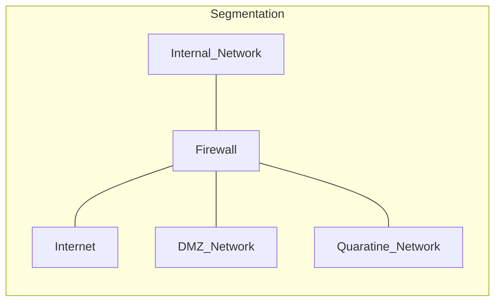
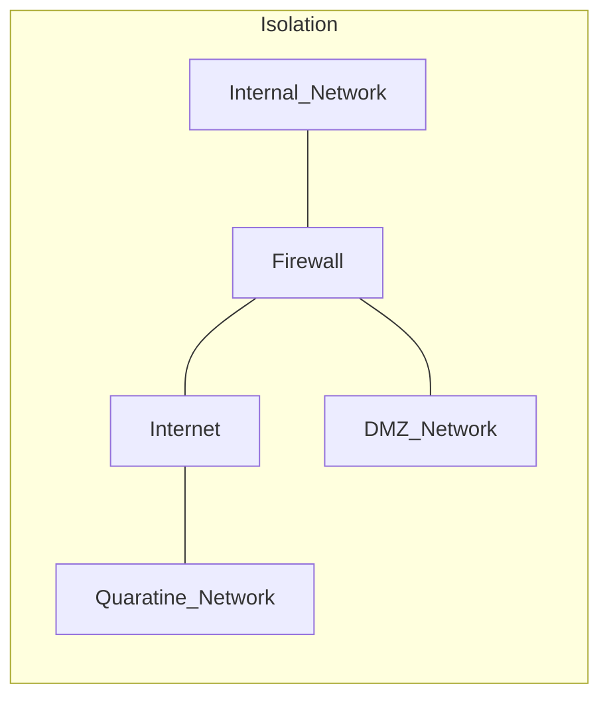
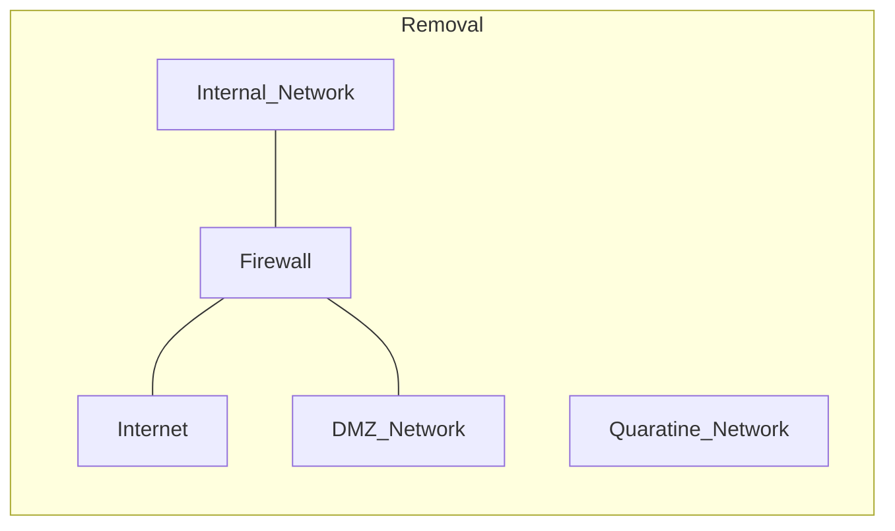

# [[Incident Response and Digital Forensics]]

Consult **NIST SP 800-61** as you develop your plan
# Incident Identification

First Responders must act quickly --> isolate affected systems

# Mitigation

After isolation, control the damage

#### Containment Strategy Evaluation
1. Damage potential
2. Evidence preservation
3. Service availability
4. Resource reuquirement
5. Expected effectiveness
6. Solution time frame

*Containment strategy:*
- Limits the damage: **segmentation** (another VLAN attache to the network), **isolation** (network completed disconnected from the rest of the network) and **removal** (completely disconnected--alerts attacker)

--> **Mitigation ends with stability**

*Eradication*: removes all traces of an incident
*Recovery*

