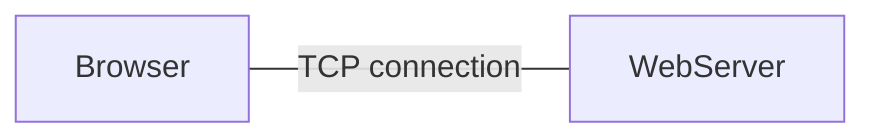
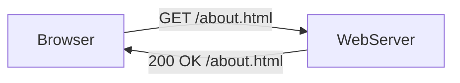
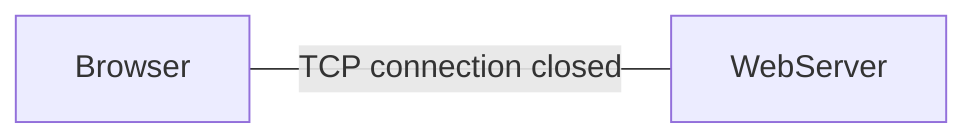

Works with request and response pairs
# Principles

### Plain Language & Human Readable
##### GET
##### POST
##### PUT
##### DELETE
##### CONNECT
##### HEAD

### Stateless Protocol

Each individual request sent over the protocol is unique and no request is connected to another request

>[!info] HTTP has no memory of previous requests

### Sessions
HTTP allows sessions (**stateful session**)
- Stored states shared between the browser and the server
- The browser sends information back and forth to the server in the form of cookies

# HTTP, HTTP/2, HTTPS

- HTTP/2 is faster and more secure than HTTP/1.1
- HTTP/1.1 sends uncompressed header, transfers one file at a time and has no default encryption

>[!important] IDEAL vs REAL
>Ideal: every HTTP > HTTPS using HTTP/2 protocol
>Real: most HTTP > HTTPS over HTTP/2 | Unencrypted HTTP/1.1

# HTTP Terminology

### Browser
Application used to access and navigate between HTML documents
### User Agent (Client)
Application acting on behalf of the user -- literally an agent of the user -- typically a browser
How the browser identificates itself to the server
### Resource
The file or files available on a server when following a URL
### Server
Computer on the internet running some form of data storage and sharing application, most commonly a web server application
### Proxy
Software or hardware service acting as a middle person between clients and servers
### Request-Response Pairs
Clients and servers communicate over HTTP using request-response pairs. A request is sent, and a response is returned
### Header
Requests and responses use HTTP headers to pass information back and forth
### HTTP Request Method/Verb
Every HTTP request contains a method -- a.k.a. a verb -- explaining what action the sender wants to perform on the resource
### Status Response Code
Numerical code in the 100 to 500 range describing what type of response the server sent back to the client
### Cache
Method for storing data on the client or the server to speed up performance

# HTTP flow

If the connection through TCP is done through TLS protocol, the data sent from browser to web server is encrypted

