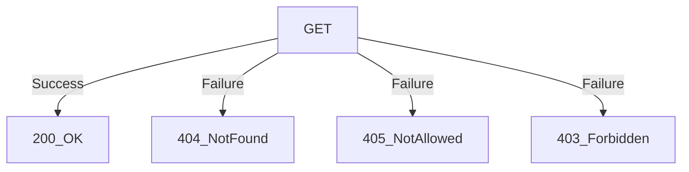
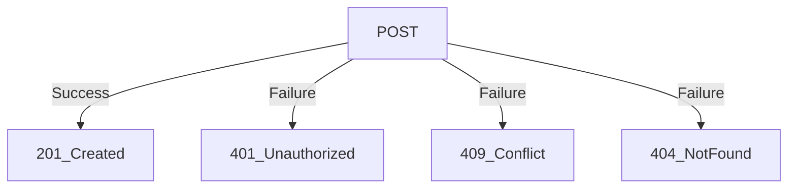
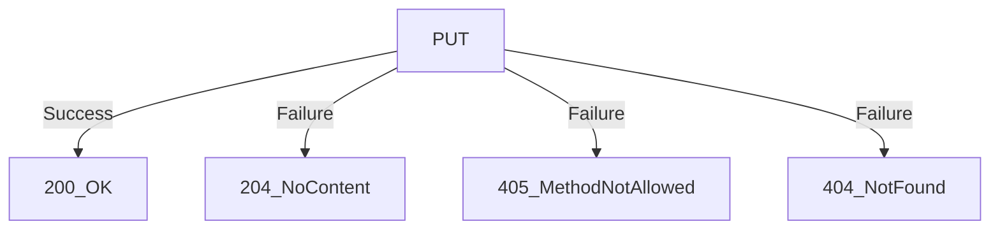
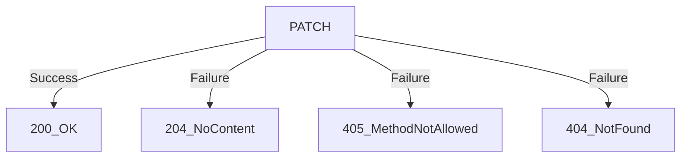
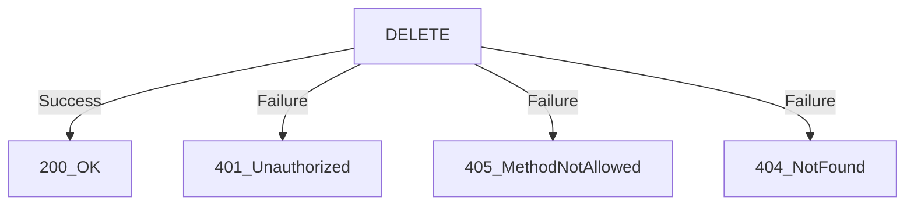
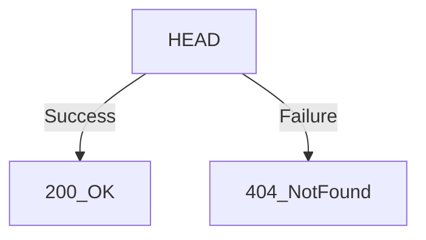
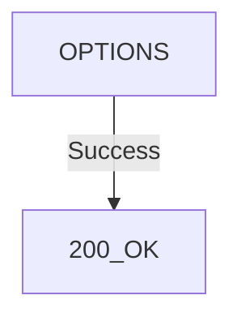
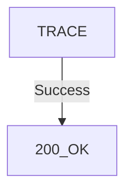

# Anatomy of a URL
Universal Resource Location

*https://*                        **linkedin\.com/learning**

***Protocol declaration*   URN: Unifrom Resource Name**

**linkedin.com** -> Host :443 - Connection port (usually hidden)
**learning ...** -> Resource path

# HTTP Methods

GET: get the specified resource, if available

POST: create anew resource and add it to a collection

PUT: update an existing singleton resource based on ID

PATCH: modify an existing singleton resource based on ID

DELETE: delete a singleton resource based on ID

HEAD: get just the response headers from the resource

OPTIONS: get the options available from this resource

TRACE: create a loopback for the request message

# HTTP status messages

| Status Code | Grouping     |
| ----------- | ------------ |
| 1xx         | Information  |
| 2xx         | Success      |
| 3xx         | Redirection  |
| 4xx         | Client error |
| 5xx         | Server error |
