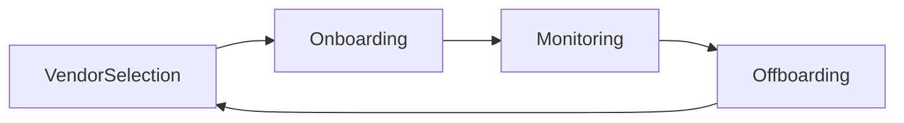

# Vendor Management Life Cycle

### [[Risk Management#^ec504d|Supply Chain Analysis]]
- Agreement should limit data sharing with third parties
- Agreements should include data protection provisions (*e.g. data escrow*)

# Cloud contract terms

- **Definition** of any term used in the contract
- Clear performance metrics in the contract or a referenced SLA
- Compliance obligations
- Right to audit
- Indemnify
- **Termination** of contract
- **Litigation**