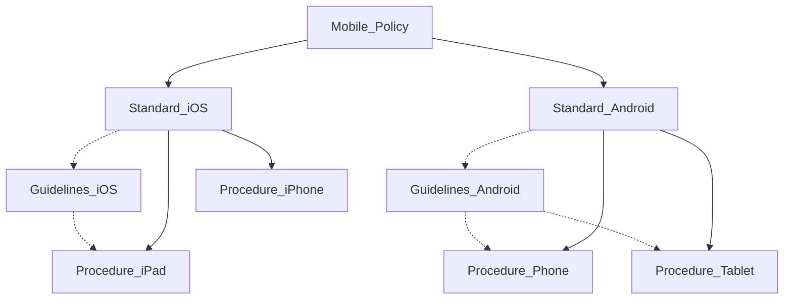

# Documentation Review

Security Documentation Flow

# Log Management Tools

**Commercial tools:**
- Splunk
- QRadar
- LogRhythm
- AlienVault

**Free and open-source tools:**
- Syslog
- Syslog-ng
- Graylog
- Elasticsearch

Logging Cheat Sheet --> [*Critical Log review Checklist for Security Incidents*](https://zeltser.com/security-incident-log-review-checklist/)

# Ruleset Review

Test firewall rules by using `nmap` to scan por open network ports --> messy

--> Tool: *Nipper*

# System Configuration Review

- Lynis
- CIS-CAT

# File Integrity Checking

- Tripwire
- OSSEC