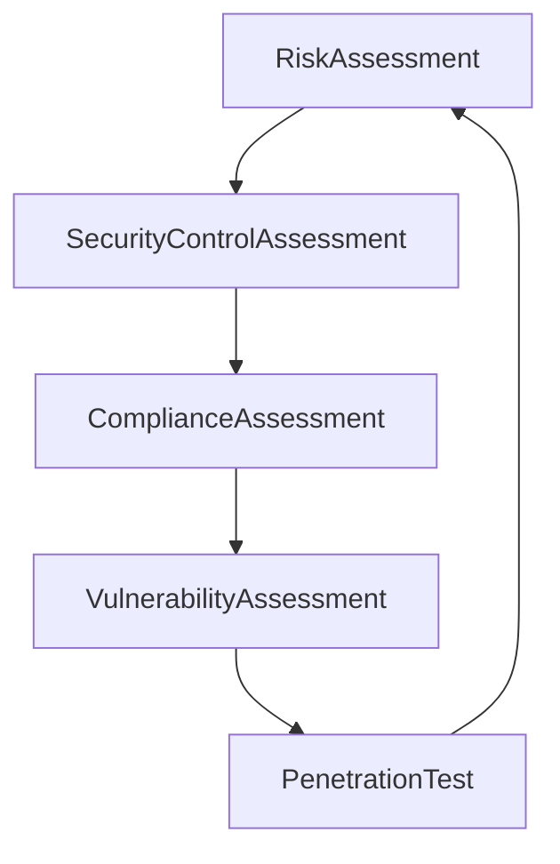

# Language is important

#### Vulnerability Scan
- Identify weaknesses
- Provide remediation recommendations
#### Penetration Test
- Identify weaknesses
- Test control effectiveness
- Provide remediation recommendations

### 5 Distinct Assessments

#####  [[1. Risk Assesment]]

**Goal**: Determine where an organization may be exposed to attack
👍input for other tests

*Threat*: circumstance or event that could damage the confidentiality, integrity, or availability of information or information systems
*Vulnerability*: weakness that enables the threat to be successful

$RiskScore = Likelihood\ x\ Impact$

Verizon DBIR: annual data breach investigations report
Privacy Rights Clearinghouse: chronology of publicly disclosed data breaches

##### 2. Security Control Assessment

**Goal**: Determine wheter or not your security program meets the specific requirements outlined by some external authority

*NIST* Special Publications

| Subseries | Topic                                       |
| --------- | ------------------------------------------- |
| SP 800    | Computer Security                           |
| SP 1800   | Cybersecurity practice guides               |
| SP 500    | Information technology (relevant documents) |
see [[Frameworks]]
--> **NIST 800-53**
- Security and Privacy Controls for Information Systems and Organizations
- Over 1000 controls
- Baseline (H/M/L)
- 18 control families

>[!Info] NIST is a technical control implementation

*ISO* 27000 Family:
- Information Security Management System (ISMS)
- 45 published standards (and counting)
- Reviewed and updated every five years
--> **ISO 27002:2022**
- Code of practice for information security controls
- 93 controls
- 14 domains
- Four control themes (organizational, physical, people and technological)

>[!Info] ISO is a security program organization

##### 3. Compliance assessment
Necessary evil

**Goal**: Determine whether or not your security program meets the specific requirements outlined by some external authority

- PCI DSS: Payment Card Industry Data Security Standard
- Stores, processes, or transmits cardholder data
👎PCI is lazy focus on critical data. It is not a Security Control Assessment, but similar

--> **Security Control Assessment**
Scope: everything
Motivation: leadership risk appetite
--> **PCI Compliance Assessment**
Scope: cardholder data envrionment (CDE)
Motivation: external authority requirement

##### 4. Vulnerability assessment

**Goal**: Validate that technical vulnerabilities are being identified and remediated on a regular basis

Scope:
- Servers 
- Endpoints
- Networks
- Applications
- Databases

Recommendations:
- Authenticated scans of all hosts systems
- Unauthenticated scans of internet-facing web applications
- Authenticated scans of non-production instances of those same applications
- Security configuration scanas of those same systems and applications

##### 5. Penetration test
Input from other assessments

**Goal**: Attempt to exploit weaknesses an attacker might take advantage of to damage the organization

- [[5. Software Quality Assurance#^951ea9|White Box]]
- [[5. Software Quality Assurance#^f9d0a9|Black Box]]
- Gray Box

