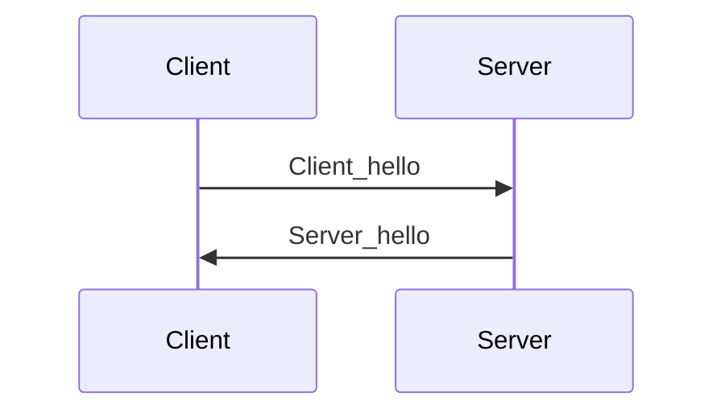
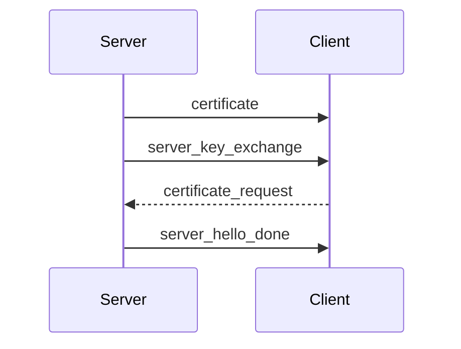
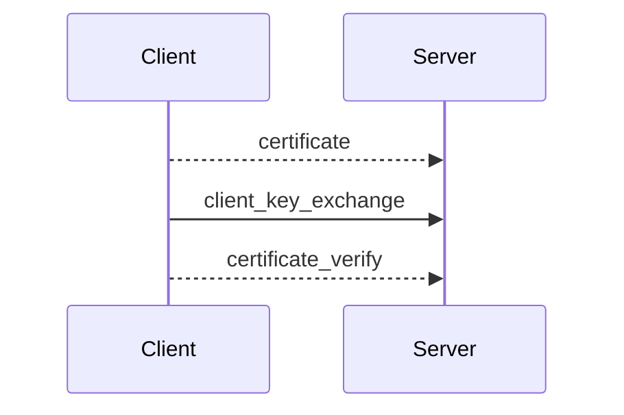
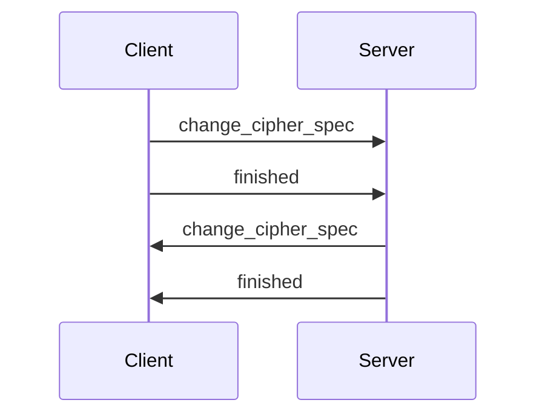

Source: [SSL/TLS and PKI History](https://www.feistyduck.com/ssl-tls-and-pki-history/)

>[!important] SSL/TLS is prevalent in every digital communication

**Root of Trust**: list of certificates that your browser *thinks* are valid or trustworthy
Certificates can grant "authentication" but always based on the Root of Trust (the root CA may be fake or the root CA may trust malicious Intermediate CA)

**Client_hello**: includes supported cipher suites
**Server_hello**: includes chosen cipher suite
➡No crypto at this point : makes it possible the **Dumbing down attack** (choose less secure cipher suite in order to eavesdrop the communication)
*Cipher suite*: key exchange method and cipher spec

>[!info] New protocols encrypt and sign the client_hello to ensure authentication

Keys are changed every few minutes

**The RoT is established by the browser** (Look in Certification Manager) - follows a Oligarchic model