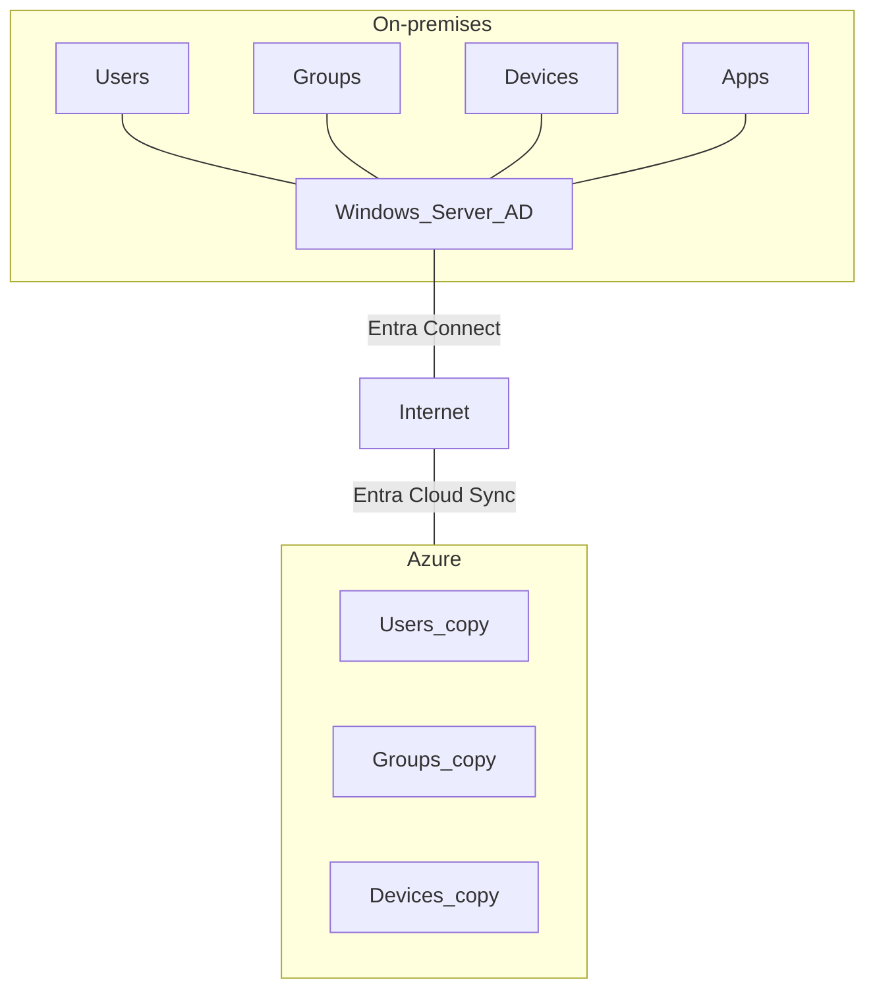
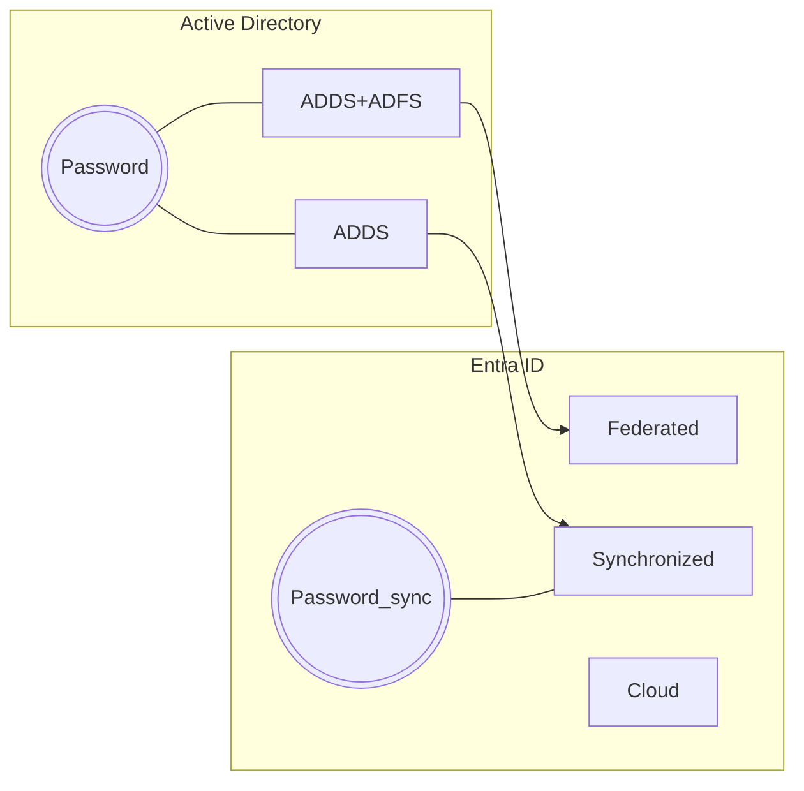
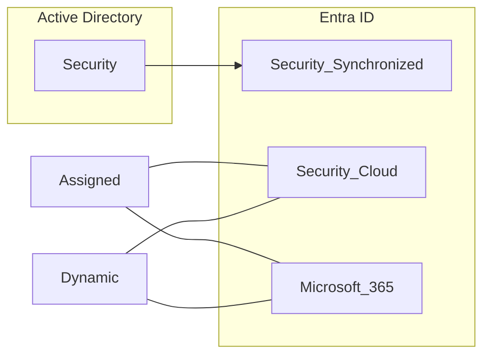
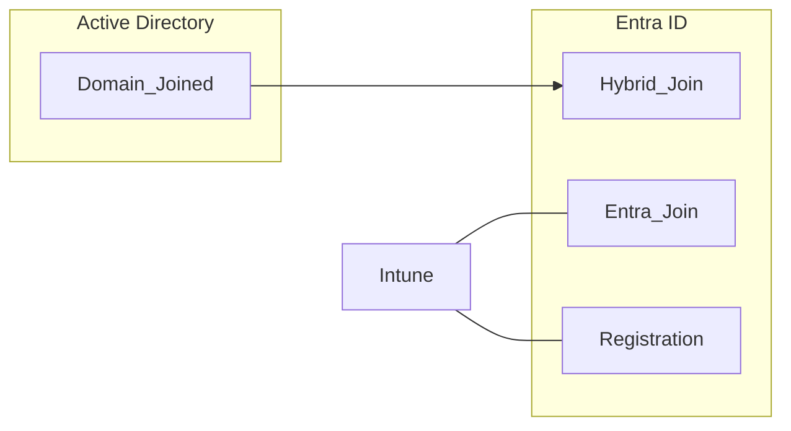
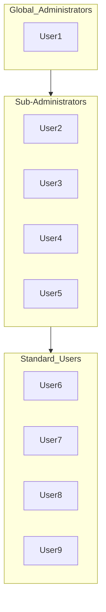
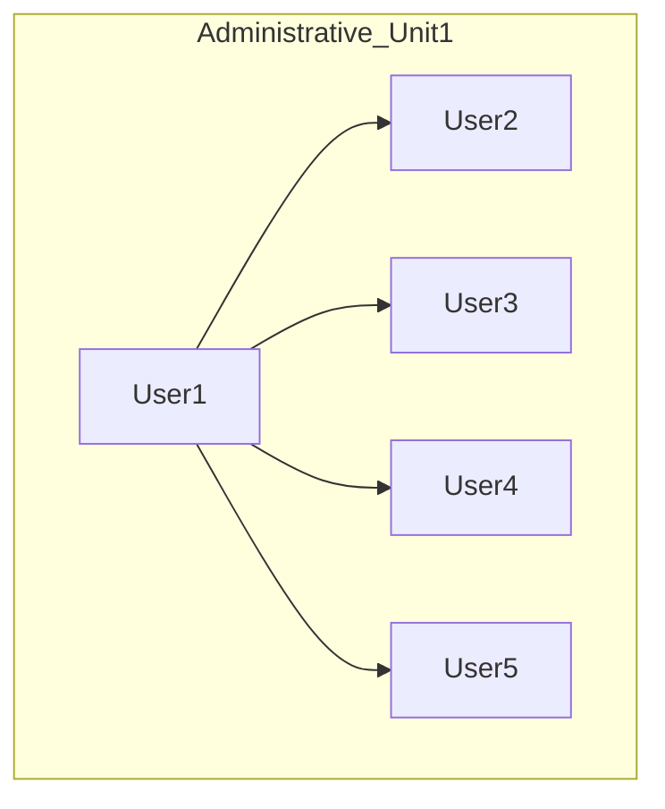
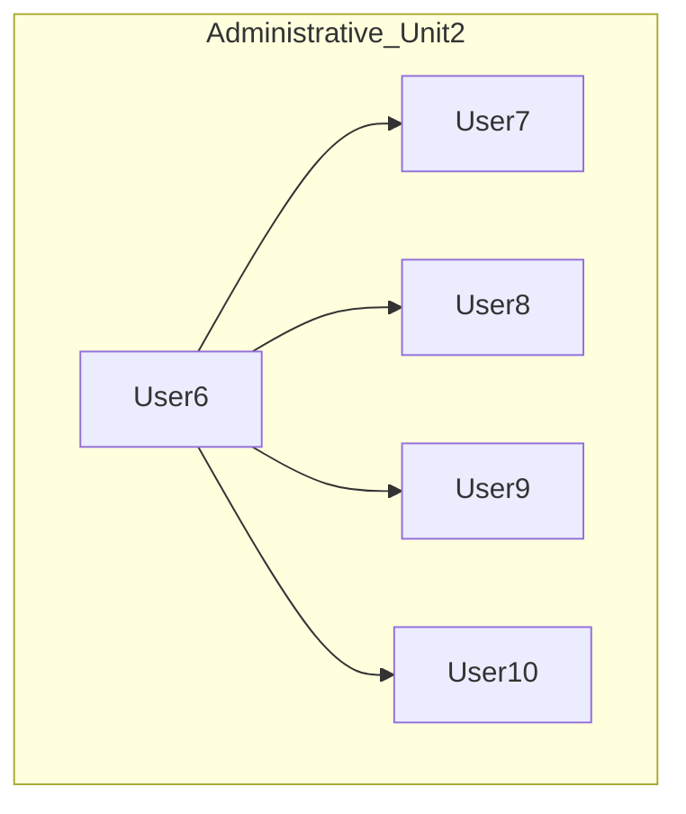

#### Entra Cloud Sync

The synchronization of Active Directory objects (users, groups, devices...) in Azure can be done via:
- **Entra Connect** tool. It requires intallation on Windows Server on-premise along with SQL Server database to store synchronization metadata ➡offers granular customization
- **Entra Cloud Sync** tool. It requires installing a lightweight provisioning agent on-premises (Microsoft's responsibility in opposite to previous option):
	Integrates Windows Server AD with Entra ID
	Simplifies identity management
	It can synchronize users, groups, and contacts
	It can filter objects based on domains, OUs, and groups
	Flow of configuration changes is bidirectional
	Source of authority for objects is Windows Server (*e.g. deletion of objects*)
	Connect multiple disconnected on-premises AD forests

#### Manage Users
Lifecycle of users depends on source of authority (SoA)

Users who require access to both on-premises and cloud:
- Federated users are managed and authenticated in AD (SoA). The password hashes are only stored on AD and not synchronized to Azure
- Synchronized users can be authenticated in AD or MEID: synchronized password hash

>[!warning] The existence of federated users and synchronized users is mutually exclusive

Users who primarily access apps and resources in Azure:
- Cloud-native users are entirely managed in the MEID (Source of Authority is Entra ID)

👑Assign Entra roles to grant administrative rights

ADDS: Active Directory Domain Services
ADFS: Active Directory Deferation Services

#### Manage Groups
Lifecycle of groups depends on source of authority

Users who require access to both on-premises and cloud:
- Synchronized Security groups are managed in AD
Users who primarily access apps and resources in Azure:
- Cloud-native Security groups are managed in Entra ID
Both security groups grant users access to resources

- Microsoft 365 groups enable collaboration among users: shared mailbox, calendar, and document libraries

Membership type can be set to Assigned or Dynamic (*premium feature*)

#### Manage Devices

- Entra Hybrid Join for computers domain-joined to AD
	⚠ Requires Entra Connect (Entra Cloud Sync does not support device synchronization) and managed using Group Policy
- Entra Join to add Windows devices directly in Entra ID
- Device Registration enables BYOD scenario for users (supports Windows, Linux, macOS, Android, and iOS)
	Both can be managed with Intune or other MDM solutions

#### Provision Enterprise Apps
Depends on the level of access you have to its source code

- Microsoft Identity Platform provides IAM for apps
- Apps Gallery is a catalog of pre-integrated SaaS apps
- Deploy as PaaS app developed by ISV or in-house (partial or full access)
- Identity methods - OpenID, OAuth, SAML, WS-Fred
- App Registration for all apps not hosted in the gallery
- Platforms - .NET, JS, Java, Python, Android, iOS...

#### Manage Administrative Units

Define scope of administration for administrators
Delegate management of a subset of resources
Apply distinct policies to different administrative units
AUs can hold users, groups, and devices as members
Restricted Management AUs to protect key objects
Modification, deletion, or password reset not allowed

>[!warning] OUs from on-premises AD are not synchronized to AUs

