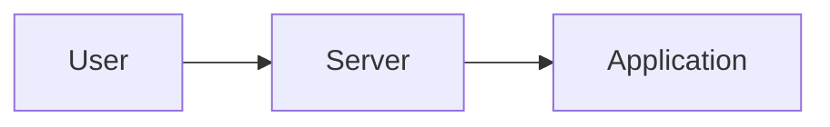
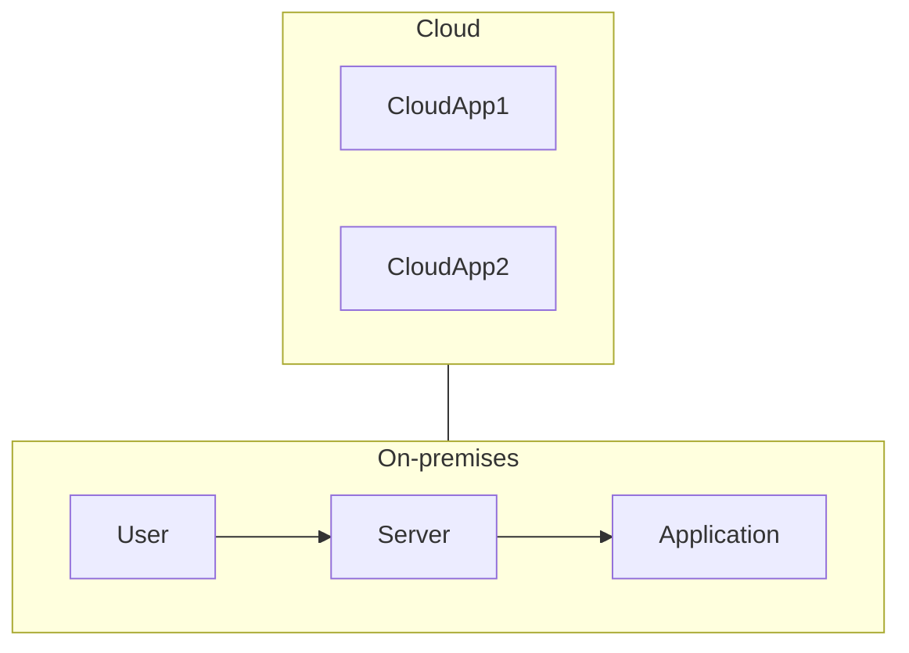

From 2024 onwards, Microsoft IT strategy changed from **server** to **cloud**

##### Authentication on-premises network

#### Challenges of authentication in the cloud

1. The authenticator server cannot be on-premise because it has not the resiliency of the cloud. It would create  *bottlenecks*.
2. Cloud apps use modern authenticator protocols that may not be supported by the on-premises server. Use of older legacy protocols is undesired
3. Cloud apps are accessed over the Internet
4. Employees want to be productive everywhere remotely, on the go
5. Employees want to use a device of their choice

*SOLUTION:* Azure Active Directory / Microsoft Entra ID

#### 1. [[Microsoft Entra ID Basics]]
#### 2. [[Core Components of Entra ID]]
#### 3. [[Standards and Compliance]]
#### 4. [[Administering an Entra Tenant]]
