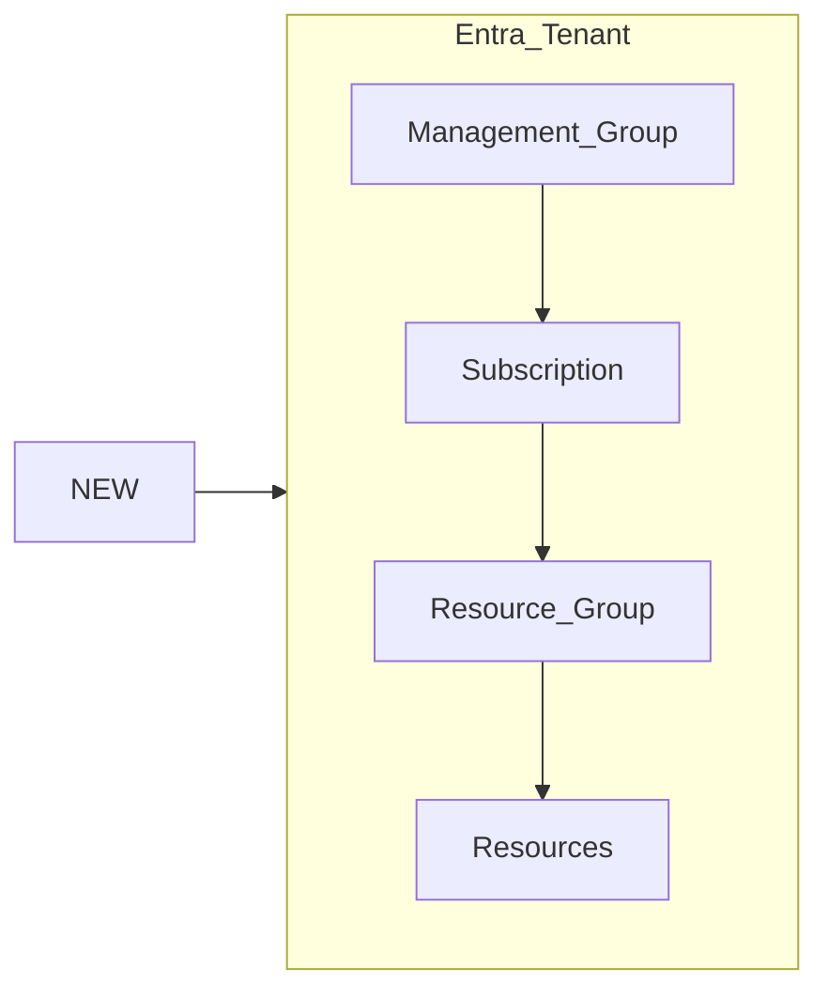
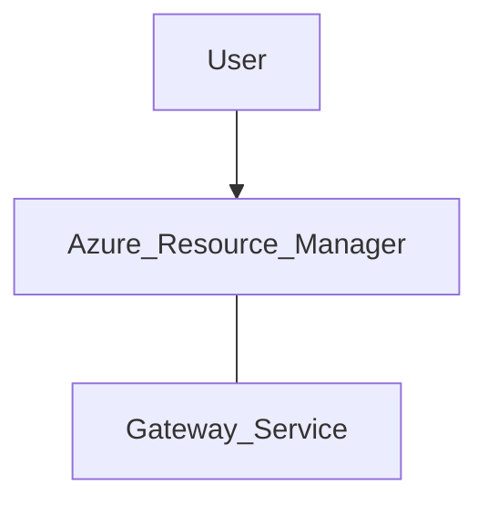

Microsoft Entra ID ≠ Windows Server AD

| Real World                             | IT World - IAM                                       |
| -------------------------------------- | ---------------------------------------------------- |
| **Passport** to prove identity         | **Credentials** for authentication                   |
| **Visa** to determine level of access  | **Permissions** for authorization                    |
| **Boarding pass** facilitates the trip | **Access token** valid for a sign-in session         |
| **Multiple checkpoints** before flight | **Multifactor authentication** for extra security    |
| **Local government** issues passports  | **Directory services server** provisions credentials |

#### What is Microsoft Entra ID?

**Identity as a Service (IDaaS)** running on Microsoft Azure
*It is not a replacement for Active Directory on-premise*. It extends the identity network beyond the on-premises network onto the cloud

- Hybrid Ready
- Open Industry Standards (OpenID, OAuth, SAML, SCIM, FIDO)
- Regulatory Compliance (ISO, SOC, PCI-DSS, HIPAA, FIPS, GDPR)
##### 4 key entitites
- Users
- Groups
- Devices
- Apps

#### Entra ID Architecture

Underneath the Entra Tenant is the **Primary Partition**: database that stores all the user objects, group objects, device objects, security identifiers and core metadata about the tenant ➡ *Brain* of your Azure account. 
It is **deployed in the data center** chosen by the user when signing up for Azure.
If the primary partition fails, there are another partitions on the data center for *redundancy*. Not only that, but this is replicated across multiple data centers: **Secondary Replicas**
The primary partition is *writeable* while the secondary replicas are *read-only* (only if the primary data center functions correctly).
The **Gateway Service** is the interface that communicates with all the replicas available

#### Active Directory vs. Entra ID

| Active Directory                                                            | Entra ID                                                                 |
| --------------------------------------------------------------------------- | ------------------------------------------------------------------------ |
| On-premises Windows Server solution                                         | IDaaS solution in Azure                                                  |
| Multi-master replication model                                              | Single-master replication model (*only one writeable primary partition*) |
| Subdomains, Domains, Trees, and Forests                                     | Flat hierarchy across the tenant                                         |
| Local or internet domains (*.loc*)                                          | Public-facing internet domain                                            |
| NTLM, Kerberos, and LDAP                                                    | OpenID, OAuth, SAML, and Graph API                                       |
| Active Directory Administrative Center (*MMC\* built on top of PowerShell*) | Microsoft Entra Admin Center or Azure portal (*more consistent*)         |
\*MMC stands for Microsoft Management Console

