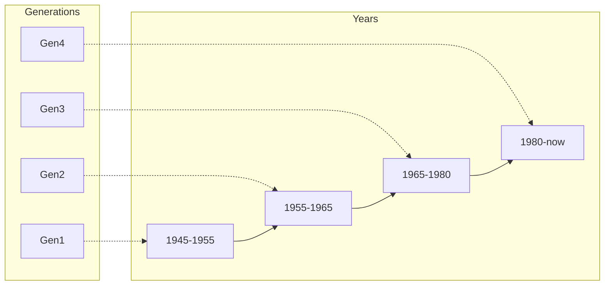

>[!info] Operating System Basics

-  **Standarized code for**:

>Input > Output > Processing > Storage

- **Several environments**:

> *Command Line Interface (CLI)*: environment where the user can type commands
> *Graphical User Interface (GUI)*: environment that provides menus, links, buttons, and fields that help users manage the operating system

>[!info] Operating System History

Generation 1 OS:
Basis

Generation 2 OS:
Mainframe computers
**Embedded operating systems**: focus on a single task, split-second response times
**Real-time Operating Systems** are a type of embedded operating systems

Generation 3 OS:
**Network operating systems**: scalable, fast , accurate and secure network communications
**UNIX** operating system: operable on multiple computer systems featured processor timesharing

Generation 4 OS:
**Multitasking operating systems**
- [[Linux]]
- [[Windows]]
- MacOS
- Chrome OS
**Mobile operating systems**
- Android
- [[Windows]]
- iOS
- ChromeOS

