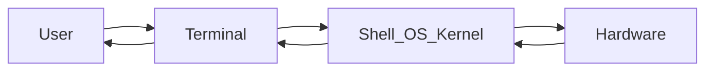

> [!info] Open-source software advantages
> - Globally diverse community
> - Customization
> - Security (public scrutiny)
> - Cost savings

### Linux kernel 
[Interactive map of Linux kernel](https://makelinux.github.io/kernel/map/)

Foundation of the OS
Manages hardware resources
Provides services
Facilitates communication between hardware and software components

### Linux distributions
Unique features and package management systems
Software repositories provide apps and tools
e.g
- **Ubuntu**: user-friendly, community support, intuitive desktop experience
- **Fedora**: cutting-edge technologies
- **CentOS**: distribution from RHEL source code, provides stability and security, popular for server deployments
- **Debian**: stability and security, range of sofware packages
- **Linux Mint**: user-friendly, familar desktop environment, smooth transition form other OS

### Interfaces
- Command-line interface (CLI)
- Graphical user interface (GUI): GNOME or KDE

### Linux shell
The **shell** is an OS-level application that interprets commands
Popular Shells:
- Bash (default)
- Zsh
- Sh
- Ksh
- Tcsh
- Fish

`$ printenv SHELL` to see shell program
switch to another shell by simply typing `$ bash`
### Linux terminal
The **terminal** is an application you use to interact with the shell

`/home/me/Documents/ $`
*Current directory*            *Prompt*

`~`: Home directory
`/`: Root directory
`..`: Parent of current directory
`.`: Current directory

#### Some useful commands (that i did not know)

`ip` - Network interface and Routing
`df` - Display Disk Space
`tar` - Archive and Compress
- `-c`: create new archive file
- `-v`: verbosely list files processed
- `-f`: archive file name
*e.g tar -cvf bin.tar /bin*
- `-x`: extract file
*e.g tar -xvf bin.tar*

`zip` - Compress `-r` to zip entire folder
`unzip` - Extract files from compressed zip file
`rsync` - Synchronize Files and Directories
`id` - user ID and group ID
`uname`
`whoami`
`grep` - `-v` to exclude that pattern
`ps` - Running processes owned by you. `ps -e` all processes running
`top` - Resource usage
`data` - Today's date
`more` - Print file contents page-by-page
`head` - Print first N lines of files
`tail` - Print last N lines of file
`wget` - Download URL
`hostname`
`echo -e` : for special characters

### File structure

- ext2 - commonly used for flash-based storage media because it minimizes the number of writes
- ext3 - added a journal or log that is used to minimize the risk of corrupting the file system in case of a power loss
- ext4 - offers improved performance and additional features

| Feature    | Slash partition (/)              | /root directory                               |
| ---------- | -------------------------------- | --------------------------------------------- |
| Definition | Foundation of the file system    | Specific directory within the slash partition |
| Purpose    | Stores all directories and files | Stores personal files of root user            |
#### Common subdirectories
##### /bin directory
Contains essential binary executables
Includes common Linux commands
##### /sbin directory
Contains binaries crucial for system maintenace tasks
Includes iptables, reboot, fdisk, and ifconfig
##### /etc directory
Stores configurations files for installed programs
Govern its behaviour and settings
##### /var directory
Stores constantly changing or growing data files
Also known as variable data files
##### /tmp directory
Stores files that clear upon system reboot
Ensures system cleanliness and efficiency
##### /home partition
Foundation for user-specific storage
Stores user's personal files
Provides restricted access
Provides user with a private space
##### /boot partition
Essential for system startup
Ensures smooth boot process

##### /proc directory
Contains information about system resources

| Run Level | Description                                                |
| --------- | ---------------------------------------------------------- |
| 0         | Halt the system                                            |
| 1         | Single-user mode                                           |
| 2         | Multi-user mode without network file system (NFS)          |
| 3         | Full multi-user mode (text-based)                          |
| 4         | Undefined or not used (reserved for user-defined settings) |
| 5         | Full multi-user mode (with graphical user interface)       |
| 6         | Reboot the system                                          |

### Security tools

##### ClamAV
##### Linux Malware Detect
##### Lynis
##### Rootkit hunter
##### chkrootkit
