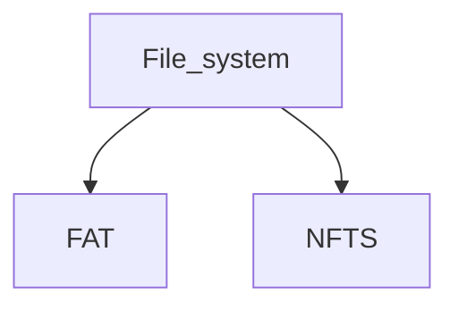

Goal: Organize digital files
Definition: Mechanism used by operating systems that access and retrieve files from Hard drives and Solid-state drives (SSDs)

##### Hard drive (HDDs): 
have moving/mechanical parts

##### Solid-state drive (SSDs):
solid-state electronics

| Feature                    | Hard drive                                                       | SSD                                |
| -------------------------- | ---------------------------------------------------------------- | ---------------------------------- |
| **Storage** **technology** | Employs magnetic storage technology                              | Modern storage device              |
| **Physical structure**     | Uses rigid, rapidly rotating disks coated with magnetic material | Uses integrated circuit assemblies |

##### FAT
*File Allocation Table*
Required for simple storage format and floppy disks
Undergone updates like FAT32
Does not support a variety of permissions

> [!info] Features and limitations
> - **Cross-platform compatibility**
> 	Preferred choice for removable media like SD cards
> - **Easy management**
> 	Easy operation on diverse platforms
> - **Limited storage**
> 	Difficulty handling large files or storage volumes

##### NTFS
*New Technology File System*
Standard operating system for Windows
More access control
Types of permissions:
- Explicit - directly applied to the file or folder
- Inherited - permissions that extend into child objects
- Effective - explicit and inherited

>[!info] Benefits
>- **Supports large volumes of data and features**
>- **Miantains a change journal**
>- **Enables setting disk quota limits**
>- **Offers hard link promoting storage efficiency**
>- **Uses master file table (MFT - central database)**
>- **Supports file permissions and encryption**