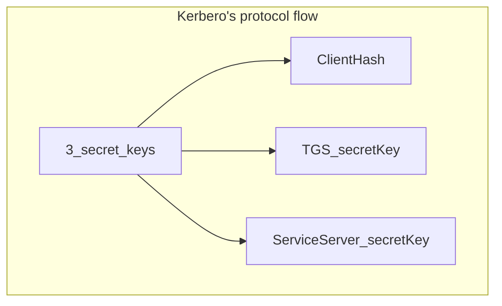

## User Account Control (UAC)
Enhances security and protects against unauthorized changes and malware
Helps maintain the integrity and security
Ensures users are aware of risky actions

#### Main prompts
- **Consent prompt**: Pop-up that asks user to verify action
- **Credential prompt**: Pop-up requesting administrative credentials

## BitLocker
Encrypts system drives or data drives
Support various authentication methods

## BitLocker To Go
Extends BitLocker encryption to removable storage devices
Encrypts the data with strong encryption algorithms

## Encrypting File System (EFS)
Encrypts file and folders on NTFS volumes
Runs the encryption and decryption processes automatically and in the background
Operates at the file level

---

# User Management and Permissions

- **Local** account
- **Microsoft** account: synchronizes Microsoft services (Outlook, OneDrive...)
- **Domain** account: for network environment, managed by a Windows Server domain controller and provides access to networks resources, shared files and printers.
  *Note: KRBTGT account*

#### [[3. Identity and Access Management#^7285bc|Kerberos]]
Exchanges secure service requests over insecure networks
Open source through Kerberos Consortium
##### Symmetric-key cryptography
- Safeguards data packets during authentication and communication
- Ensures only authorized parties can access data
##### Elements
- **Client** that initiates service requests
- **Hosting server**
- **Authentication Server (AS)**: authenticates and issues *TGT* (*Ticket Granting Ticket*) upon authentication
- **Ticket Granting Server (TGS)**: issues tickets for service access
- **Key Distribution Center (KDC)**: combines AS and TGS

##### [[3. Identity and Access Management#^55ac62|Kerberos flow]]

1. **Initial client authentication request**
- Client request TGT from AS
- Request including client's identifier is forwarded to KDC
2. **Verification of client credentials**
- KDC validates the user's credentials
- AS verifies client's credentials and generates SK1 (session key)
- TGT encrypts client information and SK1 with TGS secret key
**Message decryption**:
- Client uses secret key to decrypt message
- Client retrieves TGT and the encrypted SK1
3. **Request for access**
- Client requests a service ticket from Service Server
4. **TGS**:
- Decrypts areceived TGT using secret key
- Ensures client's credentials validity
- Validates TGT's active status through timestamp
- Crafts shared SK2 for client and server
- Creates and encrypts service ticket
- Sends ticket to client with SK2
5. **Authentication using service ticket**:
- Client decrypts service ticket with SK1 extracting SK2
- Client creates authenticator including: Client's ID, Address and Timestamp
- Sends to targeted server with service ticket
6. **Target server**
- Decrypts service ticket to extract SK2 using its secret key
- Decrypts authenticator and verifies authenticity
- Sends confirmation to client upon successful authentication

✅**Benefits**:
- Facilitates delegated authentication
- Enables SSO
- Ensures mutual authentication
