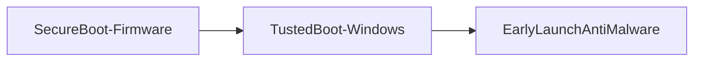

# Windows 10

Adaptable OS
Devices:
- Desktops
- Laptops
- Tablets
- Phones
- All-in-one
Updates

#### Windows 10 Home
Home users an retailers
Features:
- OneDrive
- Windows Defender
- Cortana

#### Windows 10 Pro
Small and medium-sized businesses
Business-oriented version
Professional use
Features:
- Remote Desktop
- BitLocker
- Windows Domain: group policy

#### Windows 10 Enterprise
Organizations
Offers tools for security, network optimization, and user customization
Features:
- AppLocker
- BranchCache
- User experience control

#### Windows 10 Pro for Workstations
High-end desktops and workstations
High-performing computing
Features:
- 4 CPUSs
- 6 TB of RAM
- Resilient File System (RFS)

|                | Home | Pro | Enterprise |
| -------------- | ---- | --- | ---------- |
| Domain Join    | No   | Yes | Yes        |
| Remote Desktop | No   | Yes | Yes        |
| BitLocker      | No   | Yes | Yes        |
| Direct Access  | No   | No  | Yes        |

##### BitLocker

In CMD as administrator
`manage-bde e: lock`

##### EFS
Encripted File System for Windows
You can encrypt OR compress files, not both
You need to ceate a signing certificate (either self-signed or CA)
##### Windows Boot Process
- **Secure Boot**
Handled by Unified Extensible *Firmware* Interface (UEFI) - standard
⚠*Windows 10 is not involved in this (OS hasn't started running yet)*
	UEFI verifies signature of all firmware files
	Places bootloader of the OS into memory

- **Trusted Boot**
Handled by *Windows* 10
	Load kernel - verified by certificate

- **Early Launch Anti Malware**
	Anti-Malware loaded before any device drivers (to catch malware or rootkit)
	*Windows Defender* by default

- **Measured Boot**
	Procedure of monitoring boot process
	Prove machine is in trustworthy state
	➡Which components loaded before Anti-Malware
	Results stored in Trusted Platform Module (TPM)
- **Attestation**
	TPM values sent to a remote computer
	Remote computer responds with Quote (statement about the health of this computer)
	Quote presented to other computers (decide if computer can be trusted)

##### Virtualization
- **“Hyper-V”** is a hypervisor that allows you to create virtual machines. The **“Virtual Machine Platform”** is usually used for WSL, while the **“Windows Hypervisor Platform”** is used by other virtual platforms to connect with Hyper-V.

*Note: backups store drivers and configuration, so you will probably want to restore the backup image in the same computer, or a very similar one*
# Windows 11

#### Windows 11 Home
Enhanced security features:
- Device encryption
- Find my device
- Firewall and network protection
- Secure boot

#### Windows 11 Pro
Security features to protect device and data
Features:
- BitLocker
- Parental control settings
- Windows Hello

#### Windows 11 Enterprise
Large and medium organizations
Microsoft 365 Enterprise
Features:
- OS Deployment and control over updates
- Device and app management
- Universal Print
- Advanced protection
- Windows Autopatch

#### Windows 11 Pro for Worstations
Designed for demanding tasks, intense graphics, and massive data crunching
Speed and performance enhanced

---
# [[File Systems]]

# [[Directory Structure]]
# [[Microsoft Windows Server]]

# [[Security]]

---

- **Administrative shares:** Hidden shares in a Microsoft OS, marked by a dollar sign ($), that allow system administrators remote access to all disk volumes on a network-connected system
- **Administrator account:** An account that is used exclusively for performing tasks requiring elevated permissions, such as installing new software or updates
- **Backup and recovery:** Duplicating and storing data in case of data loss due to a system crash, natural disaster, human error, or system failure
- **BitLocker:** A full-disk encryption feature in Windows Pro and Enterprise that prevents unauthorized access in case of theft or loss
- **Controlled folder access:** A Windows security feature that protects folders from unauthorized access by allowing only trusted applications to make changes
- **Effective permissions:** The combined permissions a user or group has on a file or folder, consisting of both explicit and inherited permissions
- **Explicit permissions:** Permissions applied directly to a specific file or folder
- **File Allocation Table (FAT):** A simple Windows file system that only supports read-only, hidden, system and archive file attributes
- **Hardware abstraction layer:** Software that manages communication between the kernel and the hardware
- **Inheritance:** Permissions granted to a parent folder that automatically extend to its child objects, such as subfolders and files
- **Kernel mode rootkit:** Operates at the same level as the operating system and anti-malware software, making it highly invasive and difficult to detect
- **Kernel mode:** A privileged mode in an OS with full access to hardware and system resources, used for executing critical tasks and managing hardware
- **Kernel:** The core of the OS that acts as a translator between hardware and software by managing all input/output requests, memory, and connected peripherals
- **New Technology File System (NTFS):** An advanced Windows file system offering enhanced security, granular permissions, and support for large volumes
- **NTFS permissions:** Include full control, modify, read and execute, list folder contents, read, write, and special permissions
- **Permissions:** Defines the type of access granted to folders, files, and Active Directory objects, such as full control, modify, list folder contents, read, and write
- **Rootkit:** Malicious software that enables an unauthorized user to gain control of a computer system
- **Runas:** A command in Windows that allows users to run a program or command with different user credentials, typically with elevated or administrative privileges
- **Share permissions:** Controls that determine the level of access users have to shared resources, typically including options like full control, change, read, and no access
- **System restore:** This creates restore points when you install a new app, driver, or Windows update, allowing you to roll back if the upgrade causes instability or incompatibility
- **Updates:** Provide the necessary security patches to software that minimize your exposure to malicious activity
- **User Account Control (UAC):** A security feature in Windows that helps prevent unauthorized changes to the OS by prompting for permission or an administrator password before allowing actions that could affect system settings or files
- **User mode rootkit:** Changes applications at a user level, provides backdoor access, disables system and security services, hides processes, and files, and conceals network interfaces
- **User mode:** A processing mode in an OS where applications run with limited privileges, preventing direct access to critical system resources to help ensure system stability and security
- **Windows Defender:** Constantly monitors your system for threats, activating immediately to provide robust antivirus protection and a firewall to block unwanted intrusions
- **Windows Hello:** A feature that allows you to use a PIN, facial recognition, or fingerprint to access a Windows OS. You will need a compatible device, such as a camera or fingerprint reader to use the biometric options